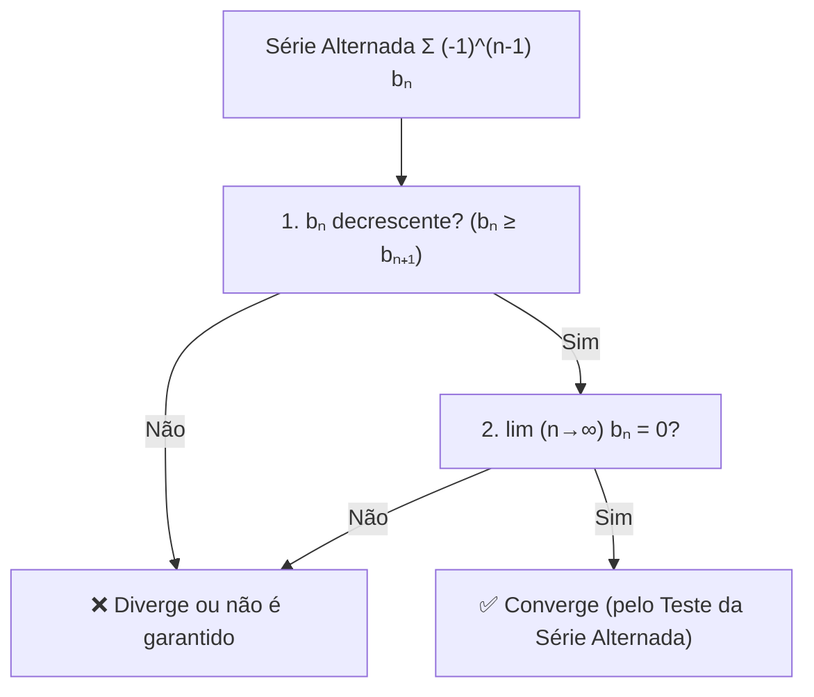
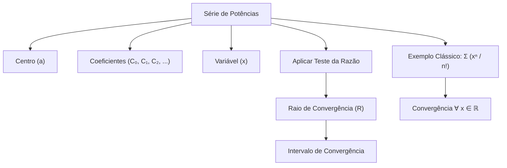

# Testes-C2
Testes Para estudar Convergência de Séries e Sequências  

# 📌 Teste da Série Alternada  

Considere uma série da forma:

Σₙ₌₁^∞ (-1)ⁿ⁻¹ bₙ = b₁ - b₂ + b₃ - b₄ + b₅ - …  
(LaTeX: \(\sum_{n=1}^{\infty} (-1)^{n-1} b_n = b_1 - b_2 + b_3 - b_4 + b_5 - \dots\))

onde  

bₙ > 0 ∀ n  
(LaTeX: \(b_n > 0 \quad \forall n\))

Essa série é chamada de *série alternada*, pois seus termos mudam de sinal sucessivamente (positivo, negativo, positivo, negativo…).

---

## ✅ Condições do Teste da Série Alternada  

A série converge se forem satisfeitas as duas condições:

1. **Decrescimento dos termos**  
bₙ ≥ bₙ₊₁ ∀ n  
(LaTeX: \(b_{n} \geq b_{n+1}, \quad \forall n \in \mathbb{N}\))  
A sequência (bₙ) deve ser *monótona decrescente*.

2. **Limite dos termos nulos**  
limₙ→∞ bₙ = 0  
(LaTeX: \(\lim_{n \to \infty} b_n = 0\))

---

## 💡 Observações Importantes  

- O teste *não exige convergência absoluta*.  
- Se a série alternada converge, mas Σ bₙ diverge, então a série é chamada de *condicionalmente convergente*.  
- Se também Σ bₙ converge, a série é *absolutamente convergente*.  
(LaTeX: \(\sum b_n\))

---

## 📘 Exemplo Clássico  

A série harmônica alternada:  

Σₙ₌₁^∞ (-1)ⁿ⁻¹ / n = 1 - 1/2 + 1/3 - 1/4 + …  
(LaTeX: \(\sum_{n=1}^{\infty} \frac{(-1)^{n-1}}{n} = 1 - \frac{1}{2} + \frac{1}{3} - \frac{1}{4} + \dots\))

- Atende às condições do teste:  
  - 1/n é decrescente  
  - limₙ→∞ 1/n = 0  
(LaTeX: \(\frac{1}{n}, \quad \lim_{n\to\infty} \frac{1}{n} = 0\))  

✅ Logo, a série *converge*.

---

## 🔎 Resumo Visual  

# 📘 Séries de Potências e Somas Infinitas

## 🔹 Definição

Série de potências centrada em `a`:

Σₙ₌₀^∞ Cₙ (x - a)ⁿ = C₀ + C₁(x-a) + C₂(x-a)² + …  
(LaTeX: \(\sum_{n=0}^{\infty} C_n (x - a)^n = C_0 + C_1(x-a) + C_2(x-a)^2 + \cdots\))

onde:
- a é o **centro** da série  
- C₀, C₁, C₂,… são **constantes (coeficientes)**  
- x é a variável real

---

## 🔹 Caso Particular: Série centrada em 0

Quando a = 0:  

Σₙ₌₀^∞ Cₙ xⁿ = C₀ + C₁x + C₂x² + …  
(LaTeX: \(\sum_{n=0}^{\infty} C_n x^n = C_0 + C_1x + C_2x^2 + \cdots\))

Para cada valor fixado de x, obtemos uma **série numérica real**.

---

## 🔹 Exemplo Clássico

Σₙ₌₀^∞ xⁿ / n!  
(LaTeX: \(\sum_{n=0}^{\infty} \frac{x^n}{n!}\))

### 🔹 Caso 1: x = 1

Σₙ₌₀^∞ 1/n!  
(LaTeX: \(\sum_{n=0}^{\infty} \frac{1}{n!}\))

Teste da Razão:

limₙ→∞ (Aₙ₊₁ / Aₙ) = limₙ→∞ 1/(n+1) = 0 < 1  
(LaTeX: \(\lim_{n \to \infty} \frac{A_{n+1}}{A_n} = \lim_{n \to \infty} \frac{1}{n+1} = 0 < 1\))

✅ Converge

---

### 🔹 Caso 2: x = 2

Σₙ₌₀^∞ 2ⁿ / n!  
(LaTeX: \(\sum_{n=0}^{\infty} \frac{2^n}{n!}\))

Teste da Razão:

limₙ→∞ |2 / (n+1)| = 0 < 1  
(LaTeX: \(\lim_{n \to \infty} \left| \frac{2}{n+1} \right| = 0 < 1\))

✅ Converge

---

### 🔹 Caso Geral: x ≠ 0

Aₙ = xⁿ / n!  
Teste da Razão: limₙ→∞ |Aₙ₊₁ / Aₙ| = limₙ→∞ |x| / (n+1) = 0 < 1  
(LaTeX: \(\lim_{n \to \infty} \left| \frac{A_{n+1}}{A_n} \right| = \lim_{n \to \infty} \frac{|x|}{n+1} = 0 < 1\))

✅ Converge ∀ x ∈ ℝ  
(LaTeX: \(x \in \mathbb{R}\))

📌 Intervalo de convergência: (-∞, +∞)  
(LaTeX: \((-\infty, +\infty)\))

