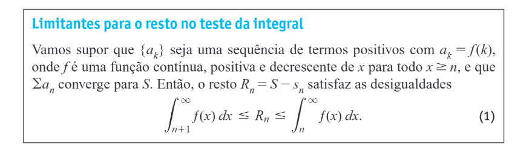
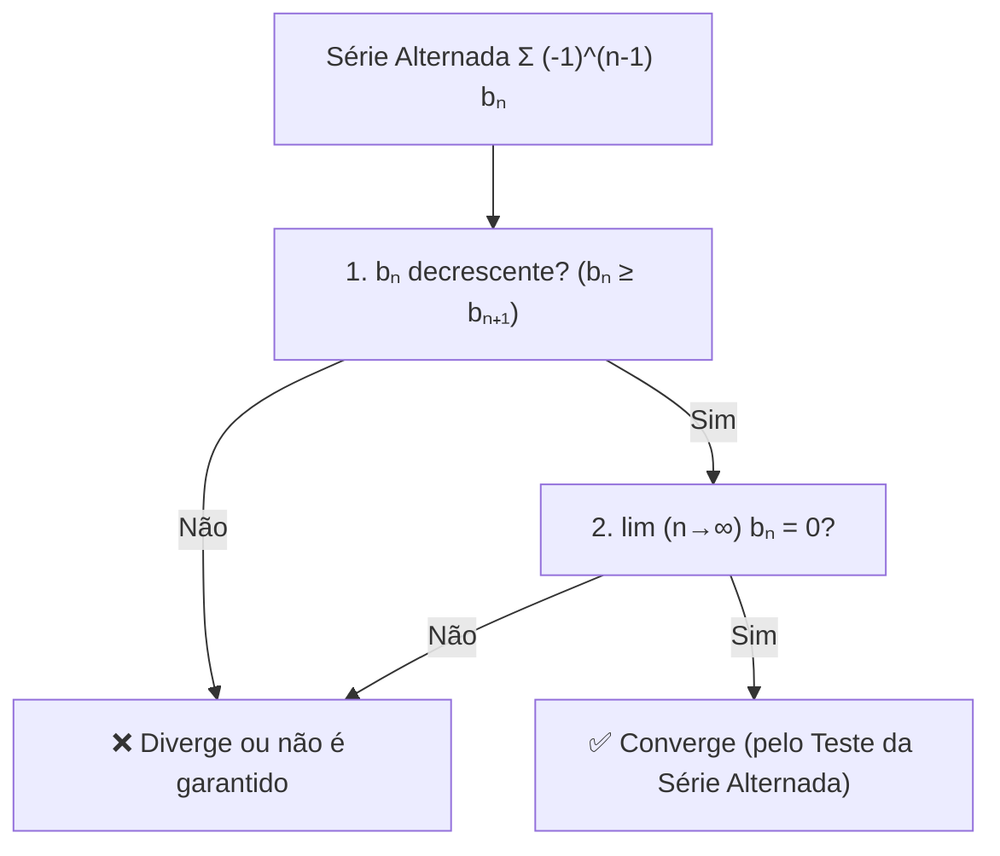
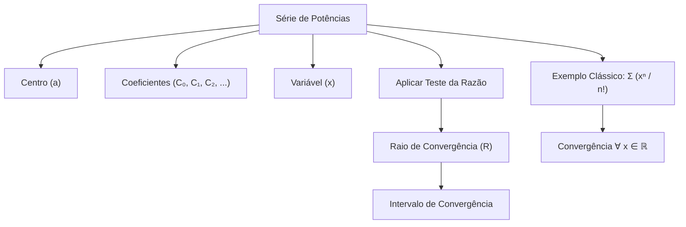

# Calculo 2
> Materiais de estudo e explicações baseado no livro Calculo vol. 2 de George Thomas. Nada muito sério e específico
------


## Definição Formal de Limite de uma Sequência (ϵ−N)

A **definição épsilon-N** é o pilar da análise de convergência em Matemática.  
Embora pareça complexa à primeira vista, o conceito é bastante intuitivo.  

---

## 🔹 Regra de Convergência

Uma sequência ${a_n}$ **converge** para um número $L$ se:
$\forall \, \epsilon > 0 \; \exists \, N \in \mathbb{N} \; \text{tal que} \; \forall n > N \implies |a_n - L| < \epsilon$

👉 Em outras palavras: **não importa o quão perto você queira que os termos da sequência cheguem de $L$, eles sempre chegarão (e permanecerão próximos).**

---

## 📌 Elementos da Definição

### 1. O que é L?
- **Limite**: É o valor para o qual a sequência está "apontando" e se aproximando.  
- Pense em $L$ como o **alvo** da sequência.

---

### 2. O Papel do $\epsilon$ (Épsilon)
- **Distância (Tolerância)**: É um número positivo arbitrariamente pequeno $(\epsilon > 0)$.  
- Representa a **margem de erro** ou a distância máxima permitida entre $a_n$ e $L$.  

> ⚠️ Importante: você **não escolhe** o $\epsilon$. Ele é dado como um **desafio**, podendo ser minúsculo (ex.: 0.000001).

---

### 3. A Condição $|a_n - L| < \epsilon$
- **Proximidade**: Essa desigualdade significa que $a_n$ está a menos de $\epsilon$ unidades de distância de $L$.  
- Equivalente a dizer que:
$a_n \in (L - \epsilon, \, L + \epsilon)$

Ou seja, os termos da sequência ficam **dentro de uma faixa de tolerância** em torno de $L$.

---

### 4. O Papel do N (Êne)
- **Índice de Viragem**: É um número natural que marca o ponto a partir do qual **todos os termos da sequência** satisfazem a proximidade exigida.  
- Se $N = 100$, isso significa que:

$a_{101}, a_{102}, a_{103}, \dots$

estão todos dentro da faixa $(L - \epsilon, \, L + \epsilon)$.  

- Quanto **menor** o $\epsilon$, **maior** o $N necessário$.

---

## 🚨 Quando não existe limite
Se **nenhum número $L$** satisfaz essa definição, dizemos que a sequência **diverge**.

---
## 📖 Quem é quem na Definição de Limite (ϵ−N)

| **Quem é?** | **Símbolo** | **Função**                                   | **Significado Intuitivo** |
|-------------|-------------|-----------------------------------------------|----------------------------|
| Limite      | $L$       | O alvo da sequência.                         | O número para onde a sequência está indo. |
| Epsilon     | $\epsilon$| A margem de erro ou exigência de proximidade. | O desafio: "Quão perto eu quero que a sequência chegue de $L$?" |
| Êne         | $N$       | O índice a partir do qual a exigência é cumprida. | A resposta: "A partir de qual termo $N$ a sequência fica e permanece dentro dessa proximidade $\epsilon$?" |

## ✅ Resumindo Intuitivamente
- $L$ = alvo da sequência  
- $\epsilon$ = margem de erro  
- $|a_n - L| < \epsilon$ = proximidade desejada  
- $N$ = ponto em que a sequência “entra na faixa” e não sai mais

---

# ♾️Séries infinitas 


>## Definições: Séries Infinitas e Convergência

Dada a sequência de números $\{a_n\}$, uma expressão da forma:

$$a_1 + a_2 + a_3 + \cdots + a_n + \cdots$$

é uma série infinita. O número $a_n$ é o n-ésimo termo da série.

---

## Sequência de Somas Parciais
A sequência $\{s_n\}$ é definida por:

$$s_1 = a_1$$

$$s_2 = a_1 + a_2$$

$$\vdots$$

$$s_n = a_1 + a_2 + \cdots + a_n = \sum_{k=1}^n a_k$$

Esta é a sequência de somas parciais da série, sendo o número $s_n$ a n-ésima soma parcial.

---

## Convergência e Divergência
Se a sequência de somas parciais $\{s_n\}$ convergir para um limite $L$, dizemos que a série converge e que a soma é $L$.

Nesse caso, também escrevemos:

$$a_1 + a_2 + \cdots + a_n + \cdots = \sum_{n=1}^{\infty} a_n = L$$

Se a sequência de somas parciais da série não converge, dizemos que a série diverge.


Podemos somar séries termo a termo, subtrair e multiplicar por constantes sem alterar a convervência ou divergência contando que, no caso da soma e da subtração, ambas convirjam ou divirjam.

>(Uma soma de sequências pode convergir se ambars divergirem...)<
 
---

## Algoritmo para Verificar se uma Série é Geométrica
>O objetivo é verificar se a razão entre termos consecutivos é constante.

## Entrada
- O termo geral da série: $a_n$.
-  
  *Exemplo:*
    $a_n = \frac{5^n}{4}$

## Saída
- **SIM, é Geométrica:** mostra a razão comum $r$.  
- **NÃO é Geométrica:** a razão entre os termos não é constante.

---

## Passos do Algoritmo

### **Passo 1: Obtenha os Termos Consecutivos**
- Defina o termo $a_n$ a partir da fórmula dada.  
- Defina o termo seguinte $a_{n+1}$ substituindo $n$ por $(n+1)$.

---

### **Passo 2: Calcule a Razão (r)**
A razão é dada por:

$$r = \frac{a_{n+1}}{a_n}$$

Simplifique a expressão o máximo possível.

---

### **Passo 3: Verifique a Constância**
- Se $r$ for uma constante (não depende de $n$), então a série **é geométrica** com razão $r$.  
- Se $r$ depender de $n$, então a série **não é geométrica**.

---

## Exemplos

### ✅ Exemplo 1: Série Geométrica
Seja:  
$$a_n = \frac{5^n}{4}$$

O termo seguinte:  
$$a_{n+1} = \frac{5^{n+1}}{4}$$

Calcule a razão:  
$$r = \frac{a_{n+1}}{a_n} = \frac{\tfrac{5^{n+1}}{4}}{\tfrac{5^n}{4}} = \frac{5^{n+1}}{5^n} = 5$$

Como $r = 5$ é constante:  
**Conclusão:** A série é geométrica com razão $r=5$.

---

### ❌ Exemplo 2: Série NÃO Geométrica
Seja:  
$$a_n = \frac{2^n}{n}$$

O termo seguinte:  
$$a_{n+1} = \frac{2^{n+1}}{n+1}$$

Calcule a razão:  
$$r = \frac{a_{n+1}}{a_n} = \frac{\tfrac{2^{n+1}}{n+1}}{\tfrac{2^n}{n}} = \frac{2^{n+1}}{n+1} \cdot \frac{n}{2^n} = \frac{2n}{n+1}$$

Como $r$ depende de $n$ (ex.: para $n=1$, $r=1$; para $n=2$, $r=\tfrac{4}{3}$):  
**Conclusão:** A série não é geométrica.

---
## Conceitos de Séries Infinitas

| Quem é?                          | Símbolo                                     | Função                                                         | Significado Intuitivo                                                                 |
|----------------------------------|---------------------------------------------|----------------------------------------------------------------|---------------------------------------------------------------------------------------|
| Teorema 7                        | Se  converge, então  | Condição necessária para convergência de uma série.            | Se os termos não vão a zero, a soma infinita não pode convergir.                      |
| Teste do n-ésimo termo p/ divergência |  diverge se  ou não existe | Critério prático para identificar séries divergentes.          | Se os termos não tendem a zero, a soma infinita “explode” (não converge).             |

--- 


---


---

##  🧪 Testes
Testes Para estudar Convergência de Séries e Sequências  

# Teste do n-ésimo termo para uma série divergente


# 📘 Teste do Termo n-ésimo

O **Teste do Termo n-ésimo** é uma ferramenta fundamental no estudo de **séries infinitas**.  
Ele estabelece uma condição necessária para a convergência de uma série.

---

## 🔹 A Regra Fundamental

Para que a série

$\sum_{n=1}^{\infty} a_n$

converja (ou seja, tenha uma soma finita $S$), é necessário que:

$\lim_{n \to \infty} a_n = 0$

---

## 💡 Intuição

Imagine que você está tentando encher um copo (o limite $S$) com infinitas gotas (os termos $a_n$):

- **Se as gotas nunca diminuem de tamanho:**  
  Se $a_n$ não tende a zero (por exemplo, $a_n \to 0.5$), você estará adicionando $0.5 + 0.5 + 0.5 + \dots$.  
  O copo nunca para de encher → **a série diverge**.

- **Se as gotas ficam cada vez menores:**  
  A única chance de convergência é se $a_n \to 0$.  
  Nesse caso, eventualmente, você estará adicionando "quase nada" ao copo.

---

## 📐 Demonstração Formal (Explicada)

O argumento é feito usando **somas parciais**.

1. **Definições**
   - $S$: o limite da série (soma total).  
   - $s_n$: a soma parcial até o termo $n$.  
     $s_n = a_1 + a_2 + \dots + a_n$  
   - $s_{n-1}$: a soma parcial anterior.  

2. **Relação chave**
   $$a_n = s_n - s_{n-1}$$

3. **Cálculo do limite**
   Se a série converge para $S$, então:
   $$\lim_{n \to \infty} s_n = S \quad \text{e} \quad \lim_{n \to \infty} s_{n-1} = S$$

   Assim:
   $$\lim_{n \to \infty} a_n = \lim_{n \to \infty}(s_n - s_{n-1}) = S - S = 0$$

✅ Conclusão: **se a série converge, então obrigatoriamente $a_n \to 0$.**

---

## 📊 Exemplo Prático (do Livro)

Considere a série:

$\sum_{n=1}^{\infty} \frac{n}{n+1} = \frac{1}{2} + \frac{2}{3} + \frac{3}{4} + \dots$

- Termo geral:
  $$a_n = \frac{n}{n+1}$$

- Limite do termo:
  $$\lim_{n \to \infty} \frac{n}{n+1} = \lim_{n \to \infty} \left( 1 - \frac{1}{n+1} \right) = 1$$

- Como o limite $\neq 0$, o teste garante que:
  $$\text{A série DIVERGE}$$

🔎 Intuição: no fim das contas, você está somando muitos números que são, essencialmente, iguais a 1.  
E $1 + 1 + 1 + \dots$ infinito → **diverge**.

---

## ⚠️ Observação Importante

O Teste do Termo n-ésimo é útil principalmente para **provar divergência**:

- Se $\lim_{n \to \infty} a_n \neq 0$ → a série **diverge**. ✅  
- Se $\lim_{n \to \infty} a_n = 0$ → o teste é **inconclusivo**. ❌  

Exemplo clássico:  
$$\sum_{n=1}^{\infty} \frac{1}{n}$$
Aqui $a_n = \frac{1}{n} \to 0$, mas a série **diverge** (Série Harmônica).  

Portanto, o teste do termo n-ésimo **não prova convergência**, apenas divergência.

---


# ∭ Teste da integral


## ✅ Condições para Aplicar o Teste da Integral

Para usar o Teste da Integral na série $\sum_{n=N}^{\infty} a_n$, precisamos verificar **TODAS** estas condições:

> **1. 🔗 Função associada**  
> Existe uma função $f(x)$ tal que $a_n = f(n)$

> **2. 📈 Contínua**  
> A função $f(x)$ deve ser contínua para $x \geq N$

> **3. ➕ Positiva**  
> A função $f(x)$ deve ser positiva para $x \geq N$, isto é, $f(x) > 0$

> **4. 📉 Decrescente**  
> A função $f(x)$ deve ser decrescente para $x \geq N$, ou seja, $f'(x) < 0$

---

## 📚 Explicação Didática da Teoria

### 💡 O que diz o teorema?

O Teste da Integral estabelece uma **conexão fundamental** entre séries e integrais impróprias:

$$\boxed{\sum_{n=N}^{\infty} a_n \quad \text{e} \quad \int_N^{\infty} f(x) \, dx}$$

**têm o mesmo comportamento de convergência!** 🎯

---

### 🤔 Por que isso funciona?

Imagine que você está somando retângulos sob a curva $y = f(x)$:

📊 Visualização Geométrica

```markdown

 Visualização Geométrica
    
f(x) |    ▓▓
     |   ▓▓▓▓
     |  ▓▓▓▓▓▓
     | ▓▓▓▓▓▓▓▓
     |▓▓▓▓▓▓▓▓▓▓
     +──────────────> x
      1  2  3  4  5

```    

---

- 📦 Cada termo $a_n = f(n)$ representa a **altura** de um retângulo de largura 1
- 🧮 A soma $\sum a_n$ **aproxima** a área sob a curva
- 📐 A integral $\int f(x) \, dx$ **calcula exatamente** essa área

**Intuição chave:** Como $f$ é decrescente e positiva, se a área sob a curva (integral) é finita, então a soma dos retângulos (série) também é finita, e vice-versa! 🔄

---

### ⚖️ Conclusão do Teste

| Integral | ⟹ | Série |
|----------|---|-------|
| ✅ **Converge** | ⟹ | ✅ **Converge** |
| ❌ **Diverge** | ⟹ | ❌ **Diverge** |

$$\text{Se } \int_N^{\infty} f(x) \, dx \text{ converge} \quad \Rightarrow \quad \sum_{n=N}^{\infty} a_n \text{ converge}$$

$$\text{Se } \int_N^{\infty} f(x) \, dx \text{ diverge} \quad \Rightarrow \quad \sum_{n=N}^{\infty} a_n \text{ diverge}$$

---

### ⚠️ Observação Importante

> 🔴 **ATENÇÃO:** O teste **NÃO nos dá o valor** da soma da série!  
> Ele apenas indica se a série **converge** ou **diverge**.

---

## 🔍 Algoritmo: Quando e Como Usar o Teste da Integral

### 📋 PASSO 1: Identificar quando usar

#### ✅ **USE o Teste da Integral quando:**

- ✔️ A série tem a forma $\sum \frac{1}{n^p}$ ou $\sum \frac{1}{n \ln n}$ ou funções similares

- ✔️ Os termos são dados por uma **fração racional** ou **função com logaritmos**

- ✔️ A função parece ser **contínua**, **positiva** e **decrescente**

#### ❌ **NÃO USE o Teste da Integral quando:**

- ❗ A série tem **termos alternados** (como $(-1)^n$)  
  👉 *Use o Teste das Séries Alternadas*

- ❗ A função **não é decrescente** (oscila ou cresce)  
  👉 *Escolha outro teste*

- ❗ Há **fatoriais** $(n!)$ ou **exponenciais** $(a^n)$  
  👉 *Use o Teste da Razão ou da Raiz*

---

### 🎬 Resumo Visual


```markdown
┌─────────────────────────────────────────┐
│  TESTE DA INTEGRAL - FLUXOGRAMA         │
├─────────────────────────────────────────┤
│                                         │
│  Série: Σ aₙ                            │
│          ↓                              │
│  f(x) tal que aₙ = f(n)?                │
│     ↓ SIM                               │
│  f contínua, positiva, decrescente?     │
│     ↓ SIM                               │
│  Calcule: ∫[N,∞] f(x)dx                 │
│          ↓                              │
│     ┌────┴────┐                         │
│  Converge  Diverge                      │
│     ↓         ↓                         │
│  Σ aₙ     Σ aₙ                           │
│ CONVERGE  DIVERGE                       │
└─────────────────────────────────────────┘


```


## 📋 Algoritmo do Teste da Integral - Versão em Tópicos

---

## 🔷 *Passo* 1: Definir a função f(x)

Substitua **n** por **x** no termo geral \(a_n\)  

Exemplo:  

$a_n = \frac{1}{n^2} \rightarrow f(x) = \frac{1}{x^2}$  

$a_n = \frac{n}{2} \rightarrow f(x) = \frac{x}{2}$

---

## 🔷 *Passo* 2: Verificar as 3 Condições

### ✅ Condição 1: Continuidade
Verifique se $f(x)$ é **contínua** para $x \geq N$.

💡 Dica: Geralmente é contínua, exceto onde há:
- Divisão por zero
- Logaritmo de número negativo ou zero
- Raiz de número negativo

---

### ✅ Condição 2: Positividade
Verifique se $f(x) > 0$ para $x \geq N$.

💡 *Dica:* Teste com valores grandes de $x$.  
Observe o sinal da função.

---

### ✅ Condição 3: Decrescimento
Calcule a derivada $f'(x)$.  
Verifique se $f'(x) < 0$ para $x \geq N$.  

✅ Se $f'(x) < 0$ → função é decrescente.  

⚠️ Se alguma condição falhar: **Não use o Teste da Integral!** Escolha outro teste.

---

## 🔷 *Passo* 3: Calcular a Integral Imprópria

### 3.1 Configurar o limite

$\int_N^{\infty} f(x)\,dx = \lim_{t \to \infty} \int_N^{t} f(x)\,dx$

### 3.2 Calcular a integral definida
- Encontre a **primitiva** de $f(x)$.  
- Calcule $\int_N^t f(x)\,dx$ usando o **Teorema Fundamental do Cálculo**.  

Resultado: $F(t) - F(N)$, onde $F$ é a primitiva.

### 3.3 Aplicar o limite

$\lim_{t \to \infty} \big[F(t) - F(N)\big]$

### 3.4 Analisar o resultado
- 🟢 Número finito → ✅ Integral **CONVERGE**  
- 🔴 Infinito ($\infty$) → ❌ Integral **DIVERGE**  
- 🔴 Não existe → ❌ Integral **DIVERGE**

---

## 🔷 *Passo* 4: Concluir sobre a Série

🎯 **Regra Final:**

$$
\boxed{
\begin{aligned}
\text{Integral CONVERGE} &\;\;\Rightarrow\;\; \text{Série CONVERGE} \\[0.5em]
\text{Integral DIVERGE} &\;\;\Rightarrow\;\; \text{Série DIVERGE}
\end{aligned}
}
$$

---

## 📝 Checklist Rápido

Use esta lista para verificar cada etapa:

- [x] **Passo 1:** Defini $f(x)$ corretamente?  
- [ ] **Passo 2a:** $f$ é contínua para $x \geq N$?  
- [ ] **Passo 2b:** $f(x) > 0$ para $x \geq N$?  
- [ ] **Passo 2c:** $f'(x) < 0$ para $x \geq N$? (decrescente)  
- [ ] **Passo 3a:** Configurei a integral imprópria com limite?  
- [ ] **Passo 3b:** Calculei a integral definida?  
- [ ] **Passo 3c:** Apliquei o limite quando $t \to \infty$?  
- [ ] **Passo 3d:** Analisei se o resultado é finito ou infinito?  
- [ ] **Passo 4:** Concluí sobre a convergência da série?


---

## 📊 Casos Clássicos

| Série | Teste da Integral | Resultado |
|:------|:-----------------|:----------|
| $\sum_{n=1}^{\infty} \frac{1}{n^p}$ com $p > 1$ | $\int_1^{\infty} \frac{1}{x^p} \, dx$ | ✅ **Converge** |
| $\sum_{n=1}^{\infty} \frac{1}{n^p}$ com $p \leq 1$ | $\int_1^{\infty} \frac{1}{x^p} \, dx$ | ❌ **Diverge** |
| $\sum_{n=1}^{\infty} \frac{1}{n}$ (série harmônica) | $\int_1^{\infty} \frac{1}{x} \, dx$ | ❌ **Diverge** |
| $\sum_{n=2}^{\infty} \frac{1}{n \ln n}$ | $\int_2^{\infty} \frac{1}{x \ln x} \, dx$ | ❌ **Diverge** |
| $\sum_{n=2}^{\infty} \frac{1}{n (\ln n)^p}$ com $p > 1$ | $\int_2^{\infty} \frac{1}{x (\ln x)^p} \, dx$ | ✅ **Converge** |
| $\sum_{n=1}^{\infty} \frac{1}{n^2}$ (Basileia) | $\int_1^{\infty} \frac{1}{x^2} \, dx$ | ✅ **Converge** = 1 |

---

### 💡 Observações Importantes

1. **Série p:** A série $\sum \frac{1}{n^p}$ é chamada de **série p** ou **série hiperarmônica**
   - Converge se e somente se $p > 1$

2. **Série Harmônica:** $\sum_{n=1}^{\infty} \frac{1}{n}$ é o caso limite quando $p = 1$
   - É **divergente** apesar dos termos tenderem a zero!

3. **Série de Basileia:** $\sum_{n=1}^{\infty} \frac{1}{n^2} = \frac{\pi^2}{6} \approx 1.645$
   - Converge, mas o teste da integral dá apenas $\int_1^{\infty} \frac{1}{x^2} dx = 1$
   - O valor exato da série é diferente do valor da integral!

4. **Generalização com Logaritmo:** Para $p > 1$:
   $$\sum_{n=2}^{\infty} \frac{1}{n (\ln n)^p} \text{ converge}$$

---


   

   ## 📏 Estimativa de Erro (O Resto $R_n$)

O objetivo dessa seção é responder à pergunta:  
**Quão errado estou se paro de somar uma série convergente em um certo ponto?**

---

### 1. Definição do Resto ($R_n$)

Se uma série convergente $\sum a_n$ tem uma soma total **S**, e você calcula a **n-ésima soma parcial** $s_n$ (a soma dos primeiros n termos), o resto $R_n$ é a diferença entre a soma total e a soma parcial:

$$R_n = S - s_n$$

O resto $R_n$ é, na verdade, a soma de todos os termos que você ignorou a partir do índice $n+1$:

$$R_n = a_{n+1} + a_{n+2} + a_{n+3} + \cdots$$

---

### 2. A Intuição Geométrica (Limites para o Resto)

A ideia central do **Teste da Integral** é comparar a soma dos termos da série (que são áreas de retângulos) com a área sob uma função contínua $f(x)$ que passa por esses pontos.

Se a série é convergente e $a_k = f(k)$, podemos visualizar o resto $R_n$ (os termos de $a_{n+1}$ em diante) como estando entre duas integrais impróprias:

- **Limite Inferior (menor que $R_n$):**  
  A área sob a curva a partir de $x = n+1$ é menor que a soma $R_n$:

  $$R_n = a_{n+1} + a_{n+2} + \cdots \geq \int_{n+1}^{\infty} f(x)\,dx$$

- **Limite Superior (maior que $R_n$):**  
  A área sob a curva a partir de $x = n$ é maior que a soma $R_n$:

  $$R_n = a_{n+1} + a_{n+2} + \cdots \leq \int_{n}^{\infty} f(x)\,dx$$

📌 **Combinando esses resultados, obtemos a desigualdade principal para o resto:**

 **$\int_{n+1}^{\infty} f(x)\,dx \leq R_n \leq \int_{n}^{\infty} f(x)\,dx \tag{1}$**

---

### 3. Estimativa da Soma Total (S)

A desigualdade acima **(1)** é útil para entender o tamanho do erro.  
No entanto, o mais prático é usá-la para estimar a **soma total $S$**.

Como $S = s_n + R_n$, você pode adicionar a soma parcial $s_n$ a todos os três lados da desigualdade (1) para obter um intervalo que contém o valor exato da soma total $S$:

**$s_n + \int_{n+1}^{\infty} f(x)\,dx \leq S \leq s_n + \int_{n}^{\infty} f(x)\,dx \tag{2}$**

---

### ✅ Conclusão Didática

A desigualdade **(2)** é a sua ferramenta final:  
Ela cria um **intervalo apertado** dentro do qual a soma verdadeira $S$ deve estar.

O erro na sua aproximação $s_n$ **não pode ser maior** que a diferença entre o limite superior e inferior do intervalo (ou seja, o comprimento do intervalo).  

🔎 Esse método fornece uma maneira robusta de **quantificar a precisão** da sua aproximação para séries que convergem pelo **Teste da Integral**.

---


# 📌 Teste da Série Alternada  

Considere uma série da forma:

 $\sum_{n=1}^{\infty} (-1)^{n-1} b_n = b_1 - b_2 + b_3 - b_4 + b_5 - \dots$

onde  

 $b_n > 0 \quad \forall n$

Essa série é chamada de *série alternada*, pois seus termos mudam de sinal sucessivamente (positivo, negativo, positivo, negativo…).

---

## ✅ Condições do Teste da Série Alternada  

A série converge se forem satisfeitas as duas condições:

1. **Decrescimento dos termos**

2.  $b_{n} \geq b_{n+1}, \quad \forall n \in \mathbb{N}$
A sequência (bₙ) deve ser *monótona decrescente*.

3. **Limite dos termos nulos**  
 
$\lim_{n \to \infty} b_n = 0$

---

## 💡 Observações Importantes  

- O teste *não exige convergência absoluta*.  
- Se a série alternada converge, mas $\sum b_n$ diverge, então a série é chamada de *condicionalmente convergente*.  
- Se também $\sum b_n$ converge, a série é *absolutamente convergente*.  


---

## 📘 Exemplo Clássico  

A série harmônica alternada:  

$\sum_{n=1}^{\infty} \frac{(-1)^{n-1}}{n} = 1 - \frac{1}{2} + \frac{1}{3} - \frac{1}{4} + \dots$

- Atende às condições do teste:  
$\frac{1}{n}, \quad \lim_{n\to\infty} \frac{1}{n} = 0$

✅ Logo, a série *converge*.

---

## 🔎 Resumo Visual  


# 📘 Séries de Potências e Somas Infinitas

## 🔹 Definição

Série de potências centrada em `a`:

$\sum_{n=0}^{\infty} C_n (x - a)^n = C_0 + C_1(x-a) + C_2(x-a)^2 + \cdots$

onde:
- a é o **centro** da série  
- C₀, C₁, C₂,… são **constantes (coeficientes)**  
- x é a variável real

---

## 🔹 Caso Particular: Série centrada em 0

Quando a = 0:  

$\sum_{n=0}^{\infty} C_n x^n = C_0 + C_1x + C_2x^2 + \cdots$

Para cada valor fixado de x, obtemos uma **série numérica real**.

---

## 🔹 Exemplo Clássico

$\sum_{n=0}^{\infty} \frac{x^n}{n!}$

### 🔹 Caso 1: x = 1

 $\sum_{n=0}^{\infty} \frac{1}{n!}$

Teste da Razão:

 $\lim_{n \to \infty} \frac{A_{n+1}}{A_n} = \lim_{n \to \infty} \frac{1}{n+1} = 0 < 1$

✅ Converge

---

### 🔹 Caso 2: x = 2

 $\sum_{n=0}^{\infty} \frac{2^n}{n!}$

Teste da Razão:

$\lim_{n \to \infty} \left| \frac{2}{n+1} \right| = 0 < 1$

✅ Converge

---

### 🔹 Caso Geral: x ≠ 0

Aₙ = xⁿ / n!  
Teste da Razão: $\lim_{n \to \infty} \left| \frac{A_{n+1}}{A_n} \right| = \lim_{n \to \infty} \frac{|x|}{n+1} = 0 < 1$

✅ Converge $x \in \mathbb{R}$

📌 Intervalo de convergência: $(-\infty, +\infty)$


 # 💡 Informações pertinentes:

 - Regras basicas de lgarítmo:

 -> $\ln\left(\frac{a}{b}\right) = \ln(a) - \ln(b)$

 -> $\ln(a \cdot b) = \ln(a) + \ln(b)$

 -> $\ln(a^n) = n\ln(a)$

 ---

 - ## 📌 p-séries

### Definição

Uma **p-série** é uma série da forma:

$\sum_{n=1}^{\infty} \frac{1}{n^p}$

onde $p > 0$ é um número real.

---

### Critério de Convergência da p-série

O comportamento depende apenas do valor de $p$:

- Se $p > 1$, a série **converge**.  
- Se $0 < p \leq 1$, a série **diverge**.  

---

### Exemplos

- Para $p = 2$:  
  $\sum_{n=1}^{\infty} \frac{1}{n^2} \quad \text{converge (resultado famoso: } = \frac{\pi^2}{6}\text{)}$

- Para $p = 1$:  
  $\sum_{n=1}^{\infty} \frac{1}{n} \quad \text{diverge (série harmônica)}$

- Para $p = \tfrac{1}{2}$:  
  $\sum_{n=1}^{\infty} \frac{1}{\sqrt{n}} \quad \text{diverge}$

---

### Importância no Cálculo 2

1. **Exemplo clássico de séries infinitas** – ajudam a entender como valores aparentemente pequenos $\tfrac{1}{n^p}$ podem ou não gerar soma finita.  

2. **Base para o Teste da Comparação** – muitas vezes, para verificar a convergência de uma série complicada, você compara com uma p-série.  

   Exemplo:  
   $\sum \frac{1}{n^2 + n} \sim \frac{1}{n^2}$  
   → converge porque se comporta como a p-série com $p=2$.  

3. **Conexão com integrais impróprias** – a demonstração do critério usa o **teste da integral**.  

4. **Aplicações em física e engenharia** – aparecem em análise de energia, sinais, métodos numéricos e até em séries de Fourier.  

---

### Resumindo

As **p-séries são um modelo de referência**.  
Saber que 

$\sum \frac{1}{n^p}$

converge **somente se $p > 1$** é uma das ferramentas principais para estudar séries em Cálculo 2.
 

 ---
