```mermaid
graph TD
    A["Série de Potências"] --> B["Centro (a)"]
    A --> C["Coeficientes (C₀, C₁, C₂, ...)"]
    A --> D["Variável (x)"]

    A --> E["Aplicar Teste da Razão"]
    E --> F["Raio de Convergência (R)"]
    F --> G["Intervalo de Convergência"]

    A --> H["Exemplo Clássico: Σ (xⁿ / n!)"]
    H --> I["Convergência ∀ x ∈ ℝ"]
```

# Calculo 2
> Materiais de estudo e explicações baseado no livro Calculo vol. 2 de George Thomas. Nada muito sério e específico
------


## Definição Formal de Limite de uma Sequência (ϵ−N)

A **definição épsilon-N** é o pilar da análise de convergência em Matemática.  
Embora pareça complexa à primeira vista, o conceito é bastante intuitivo.  

---

## 🔹 Regra de Convergência

Uma sequência ${a_n}$ **converge** para um número $L$ se:
$\forall \, \epsilon > 0 \; \exists \, N \in \mathbb{N} \; \text{tal que} \; \forall n > N \implies |a_n - L| < \epsilon$

👉 Em outras palavras: **não importa o quão perto você queira que os termos da sequência cheguem de $L$, eles sempre chegarão (e permanecerão próximos).**

---

## 📌 Elementos da Definição

### 1. O que é L?
- **Limite**: É o valor para o qual a sequência está "apontando" e se aproximando.  
- Pense em $L$ como o **alvo** da sequência.

---

### 2. O Papel do $\epsilon$ (Épsilon)
- **Distância (Tolerância)**: É um número positivo arbitrariamente pequeno $(\epsilon > 0)$.  
- Representa a **margem de erro** ou a distância máxima permitida entre $a_n$ e $L$.  

> ⚠️ Importante: você **não escolhe** o $\epsilon$. Ele é dado como um **desafio**, podendo ser minúsculo (ex.: 0.000001).

---

### 3. A Condição $|a_n - L| < \epsilon$
- **Proximidade**: Essa desigualdade significa que $a_n$ está a menos de $\epsilon$ unidades de distância de $L$.  
- Equivalente a dizer que:
$a_n \in (L - \epsilon, \, L + \epsilon)$

Ou seja, os termos da sequência ficam **dentro de uma faixa de tolerância** em torno de $L$.

---

### 4. O Papel do N (Êne)
- **Índice de Viragem**: É um número natural que marca o ponto a partir do qual **todos os termos da sequência** satisfazem a proximidade exigida.  
- Se $N = 100$, isso significa que:

$a_{101}, a_{102}, a_{103}, \dots$

estão todos dentro da faixa $(L - \epsilon, \, L + \epsilon)$.  

- Quanto **menor** o $\epsilon$, **maior** o $N necessário$.

---

## 🚨 Quando não existe limite
Se **nenhum número $L$** satisfaz essa definição, dizemos que a sequência **diverge**.

---
## 📖 Quem é quem na Definição de Limite (ϵ−N)

| **Quem é?** | **Símbolo** | **Função**                                   | **Significado Intuitivo** |
|-------------|-------------|-----------------------------------------------|----------------------------|
| Limite      | $L$       | O alvo da sequência.                         | O número para onde a sequência está indo. |
| Epsilon     | $\epsilon$| A margem de erro ou exigência de proximidade. | O desafio: "Quão perto eu quero que a sequência chegue de $L$?" |
| Êne         | $N$       | O índice a partir do qual a exigência é cumprida. | A resposta: "A partir de qual termo $N$ a sequência fica e permanece dentro dessa proximidade $\epsilon$?" |

## ✅ Resumindo Intuitivamente
- $L$ = alvo da sequência  
- $\epsilon$ = margem de erro  
- $|a_n - L| < \epsilon$ = proximidade desejada  
- $N$ = ponto em que a sequência “entra na faixa” e não sai mais

---

# ♾️Séries infinitas 


>## Definições: Séries Infinitas e Convergência

Dada a sequência de números $\{a_n\}$, uma expressão da forma:

$$a_1 + a_2 + a_3 + \cdots + a_n + \cdots$$

é uma série infinita. O número $a_n$ é o n-ésimo termo da série.

---

## Sequência de Somas Parciais
A sequência $\{s_n\}$ é definida por:

$$s_1 = a_1$$

$$s_2 = a_1 + a_2$$

$$\vdots$$

$$s_n = a_1 + a_2 + \cdots + a_n = \sum_{k=1}^n a_k$$

Esta é a sequência de somas parciais da série, sendo o número $s_n$ a n-ésima soma parcial.

---

## Convergência e Divergência
Se a sequência de somas parciais $\{s_n\}$ convergir para um limite $L$, dizemos que a série converge e que a soma é $L$.

Nesse caso, também escrevemos:

$$a_1 + a_2 + \cdots + a_n + \cdots = \sum_{n=1}^{\infty} a_n = L$$

Se a sequência de somas parciais da série não converge, dizemos que a série diverge.


Podemos somar séries termo a termo, subtrair e multiplicar por constantes sem alterar a convervência ou divergência contando que, no caso da soma e da subtração, ambas convirjam ou divirjam.

>(Uma soma de sequências pode convergir se ambars divergirem...)<
 
---

## Algoritmo para Verificar se uma Série é Geométrica
>O objetivo é verificar se a razão entre termos consecutivos é constante.

## Entrada
- O termo geral da série: $a_n$.
-  
  *Exemplo:*
    $a_n = \frac{5^n}{4}$

## Saída
- **SIM, é Geométrica:** mostra a razão comum $r$.  
- **NÃO é Geométrica:** a razão entre os termos não é constante.

---

## Passos do Algoritmo

### **Passo 1: Obtenha os Termos Consecutivos**
- Defina o termo $a_n$ a partir da fórmula dada.  
- Defina o termo seguinte $a_{n+1}$ substituindo $n$ por $(n+1)$.

---

### **Passo 2: Calcule a Razão (r)**
A razão é dada por:

$$r = \frac{a_{n+1}}{a_n}$$

Simplifique a expressão o máximo possível.

---

### **Passo 3: Verifique a Constância**
- Se $r$ for uma constante (não depende de $n$), então a série **é geométrica** com razão $r$.  
- Se $r$ depender de $n$, então a série **não é geométrica**.

---

## Exemplos

### ✅ Exemplo 1: Série Geométrica
Seja:  
$$a_n = \frac{5^n}{4}$$

O termo seguinte:  
$$a_{n+1} = \frac{5^{n+1}}{4}$$

Calcule a razão:  
$$r = \frac{a_{n+1}}{a_n} = \frac{\tfrac{5^{n+1}}{4}}{\tfrac{5^n}{4}} = \frac{5^{n+1}}{5^n} = 5$$

Como $r = 5$ é constante:  
**Conclusão:** A série é geométrica com razão $r=5$.

---

### ❌ Exemplo 2: Série NÃO Geométrica
Seja:  
$$a_n = \frac{2^n}{n}$$

O termo seguinte:  
$$a_{n+1} = \frac{2^{n+1}}{n+1}$$

Calcule a razão:  
$$r = \frac{a_{n+1}}{a_n} = \frac{\tfrac{2^{n+1}}{n+1}}{\tfrac{2^n}{n}} = \frac{2^{n+1}}{n+1} \cdot \frac{n}{2^n} = \frac{2n}{n+1}$$

Como $r$ depende de $n$ (ex.: para $n=1$, $r=1$; para $n=2$, $r=\tfrac{4}{3}$):  
**Conclusão:** A série não é geométrica.

---
## Conceitos de Séries Infinitas

| Quem é?                          | Símbolo                                     | Função                                                         | Significado Intuitivo                                                                 |
|----------------------------------|---------------------------------------------|----------------------------------------------------------------|---------------------------------------------------------------------------------------|
| Teorema 7                        | Se  converge, então  | Condição necessária para convergência de uma série.            | Se os termos não vão a zero, a soma infinita não pode convergir.                      |
| Teste do n-ésimo termo p/ divergência |  diverge se  ou não existe | Critério prático para identificar séries divergentes.          | Se os termos não tendem a zero, a soma infinita “explode†(não converge).             |

--- 


---


---

##  🧪 Testes
Testes Para estudar Convergência de Séries e Sequências  

# Teste do n-ésimo termo para uma série divergente


# 📘 Teste do Termo n-ésimo

O **Teste do Termo n-ésimo** é uma ferramenta fundamental no estudo de **séries infinitas**.  
Ele estabelece uma condição necessária para a convergência de uma série.

---

## 🔹 A Regra Fundamental

Para que a série

$\sum_{n=1}^{\infty} a_n$

converja (ou seja, tenha uma soma finita $S$), é necessário que:

$\lim_{n \to \infty} a_n = 0$

---

## 💡 Intuição

Imagine que você está tentando encher um copo (o limite $S$) com infinitas gotas (os termos $a_n$):

- **Se as gotas nunca diminuem de tamanho:**  
  Se $a_n$ não tende a zero (por exemplo, $a_n \to 0.5$), você estará adicionando $0.5 + 0.5 + 0.5 + \dots$.  
  O copo nunca para de encher → **a série diverge**.

- **Se as gotas ficam cada vez menores:**  
  A única chance de convergência é se $a_n \to 0$.  
  Nesse caso, eventualmente, você estará adicionando "quase nada" ao copo.

---

## 📐 Demonstração Formal (Explicada)

O argumento é feito usando **somas parciais**.

1. **Definições**
   - $S$: o limite da série (soma total).  
   - $s_n$: a soma parcial até o termo $n$.  
     $s_n = a_1 + a_2 + \dots + a_n$  
   - $s_{n-1}$: a soma parcial anterior.  

2. **Relação chave**
   $$a_n = s_n - s_{n-1}$$

3. **Cálculo do limite**
   Se a série converge para $S$, então:
   $$\lim_{n \to \infty} s_n = S \quad \text{e} \quad \lim_{n \to \infty} s_{n-1} = S$$

   Assim:
   $$\lim_{n \to \infty} a_n = \lim_{n \to \infty}(s_n - s_{n-1}) = S - S = 0$$

✅ Conclusão: **se a série converge, então obrigatoriamente $a_n \to 0$.**

---

## 📊 Exemplo Prático (do Livro)

Considere a série:

$\sum_{n=1}^{\infty} \frac{n}{n+1} = \frac{1}{2} + \frac{2}{3} + \frac{3}{4} + \dots$

- Termo geral:
  $$a_n = \frac{n}{n+1}$$

- Limite do termo:
  $$\lim_{n \to \infty} \frac{n}{n+1} = \lim_{n \to \infty} \left( 1 - \frac{1}{n+1} \right) = 1$$

- Como o limite $\neq 0$, o teste garante que:
  $$\text{A série DIVERGE}$$

🔎 Intuição: no fim das contas, você está somando muitos números que são, essencialmente, iguais a 1.  
E $1 + 1 + 1 + \dots$ infinito → **diverge**.

---

## ⚠️ Observação Importante

O Teste do Termo n-ésimo é útil principalmente para **provar divergência**:

- Se $\lim_{n \to \infty} a_n \neq 0$ → a série **diverge**. ✅  
- Se $\lim_{n \to \infty} a_n = 0$ → o teste é **inconclusivo**. ❌ 

Exemplo clássico:  
$$\sum_{n=1}^{\infty} \frac{1}{n}$$
Aqui $a_n = \frac{1}{n} \to 0$, mas a série **diverge** (Série Harmônica).  

Portanto, o teste do termo n-ésimo **não prova convergência**, apenas divergência.

---


# ∭ Teste da integral


## ✅ Condições para Aplicar o Teste da Integral

Para usar o Teste da Integral na série $\sum_{n=N}^{\infty} a_n$, precisamos verificar **TODAS** estas condições:

> **1. 🔗 Função associada**  
> Existe uma função $f(x)$ tal que $a_n = f(n)$

> **2. 📈 Contínua**  
> A função $f(x)$ deve ser contínua para $x \geq N$

> **3. ➕ Positiva**  
> A função $f(x)$ deve ser positiva para $x \geq N$, isto é, $f(x) > 0$

> **4. 📉 Decrescente**  
> A função $f(x)$ deve ser decrescente para $x \geq N$, ou seja, $f'(x) < 0$

---

## 📚 Explicação Didática da Teoria

### 💡 O que diz o teorema?

O Teste da Integral estabelece uma **conexão fundamental** entre séries e integrais impróprias:

$$\boxed{\sum_{n=N}^{\infty} a_n \quad \text{e} \quad \int_N^{\infty} f(x) \, dx}$$

**têm o mesmo comportamento de convergência!** 🎯

---

### 🤔 Por que isso funciona?

Imagine que você está somando retângulos sob a curva $y = f(x)$:

📊 Visualização Geométrica


```markdown

 Visualização Geométrica
    
f(x) |    ▓▓
     |   ▓▓▓▓
     |  ▓▓▓▓▓▓
     | ▓▓▓▓▓▓▓▓
     |▓▓▓▓▓▓▓▓▓▓
     +──────────────> x
      1  2  3  4  5

```    

---

- 📦 Cada termo $a_n = f(n)$ representa a **altura** de um retângulo de largura 1
- 🧮 A soma $\sum a_n$ **aproxima** a área sob a curva
- 📐 A integral $\int f(x) \, dx$ **calcula exatamente** essa área

**Intuição chave:** Como $f$ é decrescente e positiva, se a área sob a curva (integral) é finita, então a soma dos retângulos (série) também é finita, e vice-versa! 🔄

---

### ⚖️ Conclusão do Teste

| Integral | ⟹ | Série |
|----------|---|-------|
| ✅ **Converge** | ⟹ | ✅ **Converge** |
| ❌ **Diverge** | ⟹ | ❌ **Diverge** |

$$\text{Se } \int_N^{\infty} f(x) \, dx \text{ converge} \quad \Rightarrow \quad \sum_{n=N}^{\infty} a_n \text{ converge}$$

$$\text{Se } \int_N^{\infty} f(x) \, dx \text{ diverge} \quad \Rightarrow \quad \sum_{n=N}^{\infty} a_n \text{ diverge}$$

---

### ⚠️ Observação Importante

> 🔴 **ATENÇÃO:** O teste **NÃO nos dá o valor** da soma da série!  
> Ele apenas indica se a série **converge** ou **diverge**.

---

## 🔍 Algoritmo: Quando e Como Usar o Teste da Integral

### 📋 PASSO 1: Identificar quando usar

#### ✅ **USE o Teste da Integral quando:**

- ✔️ A série tem a forma $\sum \frac{1}{n^p}$ ou $\sum \frac{1}{n \ln n}$ ou funções similares

- ✔️ Os termos são dados por uma **fração racional** ou **função com logaritmos**

- ✔️ A função parece ser **contínua**, **positiva** e **decrescente**

#### ❌ **NÃO USE o Teste da Integral quando:**

- ❗ A série tem **termos alternados** (como $(-1)^n$)  
  👉 *Use o Teste das Séries Alternadas*

- ❗ A função **não é decrescente** (oscila ou cresce)  
  👉 *Escolha outro teste*

- ❗ Há **fatoriais** $(n!)$ ou **exponenciais** $(a^n)$  
  👉 *Use o Teste da Razão ou da Raiz*

---

### 🎬 Resumo Visual


```markdown
┌─────────────────────────────────────────┐
│  TESTE DA INTEGRAL - FLUXOGRAMA         │
├─────────────────────────────────────────┤
│                                         │
│  Série: Σ aₙ                            │
│          ↓                              │
│  f(x) tal que aₙ = f(n)?                │
│     ↓ SIM                               │
│  f contínua, positiva, decrescente?     │
│     ↓ SIM                               │
│  Calcule: ∫[N,∞] f(x)dx                 │
│          ↓                              │
│     ┌────┴────┐                         │
│  Converge  Diverge                      │
│     ↓         ↓                         │
│  Σ aₙ     Σ aₙ                           │
│ CONVERGE  DIVERGE                       │
└─────────────────────────────────────────┘


```


## 📋 Algoritmo do Teste da Integral - Versão em Tópicos

---

## 🔷 *Passo* 1: Definir a função f(x)

Substitua **n** por **x** no termo geral \(a_n\)  

Exemplo:  

$a_n = \frac{1}{n^2} \rightarrow f(x) = \frac{1}{x^2}$  

$a_n = \frac{n}{2} \rightarrow f(x) = \frac{x}{2}$

---

## 🔷 *Passo* 2: Verificar as 3 Condições

### ✅ Condição 1: Continuidade
Verifique se $f(x)$ é **contínua** para $x \geq N$.

💡 Dica: Geralmente é contínua, exceto onde há:
- Divisão por zero
- Logaritmo de número negativo ou zero
- Raiz de número negativo

---

### ✅ Condição 2: Positividade
Verifique se $f(x) > 0$ para $x \geq N$.

💡 *Dica:* Teste com valores grandes de $x$.  
Observe o sinal da função.

---

### ✅ Condição 3: Decrescimento
Calcule a derivada $f'(x)$.  
Verifique se $f'(x) < 0$ para $x \geq N$.  

✅ Se $f'(x) < 0$ → função é decrescente.  

⚠️ Se alguma condição falhar: **Não use o Teste da Integral!** Escolha outro teste.

---

## 🔷 *Passo* 3: Calcular a Integral Imprópria

### 3.1 Configurar o limite

$\int_N^{\infty} f(x)\,dx = \lim_{t \to \infty} \int_N^{t} f(x)\,dx$

### 3.2 Calcular a integral definida
- Encontre a **primitiva** de $f(x)$.  
- Calcule $\int_N^t f(x)\,dx$ usando o **Teorema Fundamental do Cálculo**.  

Resultado: $F(t) - F(N)$, onde $F$ é a primitiva.

### 3.3 Aplicar o limite

$\lim_{t \to \infty} \big[F(t) - F(N)\big]$

### 3.4 Analisar o resultado
- 🟢 Número finito → ✅ Integral **CONVERGE**  
- 🔴 Infinito ($\infty$) → ❌ Integral **DIVERGE**  
- 🔴 Não existe → ❌ Integral **DIVERGE**

---

## 🔷 *Passo* 4: Concluir sobre a Série

🎯 **Regra Final:**

$$
\boxed{
\begin{aligned}
\text{Integral CONVERGE} &\;\;\Rightarrow\;\; \text{Série CONVERGE} \\[0.5em]
\text{Integral DIVERGE} &\;\;\Rightarrow\;\; \text{Série DIVERGE}
\end{aligned}
}
$$

---

## 📝 Checklist Rápido

Use esta lista para verificar cada etapa:

- [ ] **Passo 1:** Defini $f(x)$ corretamente?  
- [ ] **Passo 2a:** $f$ é contínua para $x \geq N$?  
- [ ] **Passo 2b:** $f(x) > 0$ para $x \geq N$?  
- [ ] **Passo 2c:** $f'(x) < 0$ para $x \geq N$? (decrescente)  
- [ ] **Passo 3a:** Configurei a integral imprópria com limite?  
- [ ] **Passo 3b:** Calculei a integral definida?  
- [ ] **Passo 3c:** Apliquei o limite quando $t \to \infty$?  
- [ ] **Passo 3d:** Analisei se o resultado é finito ou infinito?  
- [ ] **Passo 4:** Concluí sobre a convergência da série?


---

## 📊 Casos Clássicos

| Série | Teste da Integral | Resultado |
|:------|:-----------------|:----------|
| $\sum_{n=1}^{\infty} \frac{1}{n^p}$ com $p > 1$ | $\int_1^{\infty} \frac{1}{x^p} \, dx$ | ✅ **Converge** |
| $\sum_{n=1}^{\infty} \frac{1}{n^p}$ com $p \leq 1$ | $\int_1^{\infty} \frac{1}{x^p} \, dx$ | ❌ **Diverge** |
| $\sum_{n=1}^{\infty} \frac{1}{n}$ (série harmônica) | $\int_1^{\infty} \frac{1}{x} \, dx$ | ❌ **Diverge** |
| $\sum_{n=2}^{\infty} \frac{1}{n \ln n}$ | $\int_2^{\infty} \frac{1}{x \ln x} \, dx$ | ❌ **Diverge** |
| $\sum_{n=2}^{\infty} \frac{1}{n (\ln n)^p}$ com $p > 1$ | $\int_2^{\infty} \frac{1}{x (\ln x)^p} \, dx$ | ✅ **Converge** |
| $\sum_{n=1}^{\infty} \frac{1}{n^2}$ (Basileia) | $\int_1^{\infty} \frac{1}{x^2} \, dx$ | ✅ **Converge** = 1 |

---

### 💡 Observações Importantes

1. **Série p:** A série $\sum \frac{1}{n^p}$ é chamada de **série p** ou **série hiperarmônica**
   - Converge se e somente se $p > 1$

2. **Série Harmônica:** $\sum_{n=1}^{\infty} \frac{1}{n}$ é o caso limite quando $p = 1$
   - É **divergente** apesar dos termos tenderem a zero!

3. **Série de Basileia:** $\sum_{n=1}^{\infty} \frac{1}{n^2} = \frac{\pi^2}{6} \approx 1.645$
   - Converge, mas o teste da integral dá apenas $\int_1^{\infty} \frac{1}{x^2} dx = 1$
   - O valor exato da série é diferente do valor da integral!

4. **Generalização com Logaritmo:** Para $p > 1$:
   $$\sum_{n=2}^{\infty} \frac{1}{n (\ln n)^p} \text{ converge}$$

---


   

   ## 📏 Estimativa de Erro (O Resto $R_n$)

O objetivo dessa seção é responder à pergunta:  
**Quão errado estou se paro de somar uma série convergente em um certo ponto?**

---

### 1. Definição do Resto ($R_n$)

Se uma série convergente $\sum a_n$ tem uma soma total **S**, e você calcula a **n-ésima soma parcial** $s_n$ (a soma dos primeiros n termos), o resto $R_n$ é a diferença entre a soma total e a soma parcial:

$$R_n = S - s_n$$

O resto $R_n$ é, na verdade, a soma de todos os termos que você ignorou a partir do índice $n+1$:

$$R_n = a_{n+1} + a_{n+2} + a_{n+3} + \cdots$$

---

### 2. A Intuição Geométrica (Limites para o Resto)

A ideia central do **Teste da Integral** é comparar a soma dos termos da série (que são áreas de retângulos) com a área sob uma função contínua $f(x)$ que passa por esses pontos.

Se a série é convergente e $a_k = f(k)$, podemos visualizar o resto $R_n$ (os termos de $a_{n+1}$ em diante) como estando entre duas integrais impróprias:

- **Limite Inferior (menor que $R_n$):**  
  A área sob a curva a partir de $x = n+1$ é menor que a soma $R_n$:

  $$R_n = a_{n+1} + a_{n+2} + \cdots \geq \int_{n+1}^{\infty} f(x)\,dx$$

- **Limite Superior (maior que $R_n$):**  
  A área sob a curva a partir de $x = n$ é maior que a soma $R_n$:

  $$R_n = a_{n+1} + a_{n+2} + \cdots \leq \int_{n}^{\infty} f(x)\,dx$$

📌 **Combinando esses resultados, obtemos a desigualdade principal para o resto:**

- $$\int_{n+1}^{\infty} f(x)\,dx \leq R_n \leq \int_{n}^{\infty} f(x)\,dx\tag{1}$$

---

### 3. Estimativa da Soma Total (S)

A desigualdade acima **(1)** é útil para entender o tamanho do erro.  
No entanto, o mais prático é usá-la para estimar a **soma total $S$**.

Como $S = s_n + R_n$, você pode adicionar a soma parcial $s_n$ a todos os três lados da desigualdade (1) para obter um intervalo que contém o valor exato da soma total $S$:

- $$s_n + \int_{n+1}^{\infty} f(x)\,dx \leq S \leq s_n + \int_{n}^{\infty} f(x)\,dx\tag{2}$$

---

### ✅ Conclusão Didática

A desigualdade **(2)** é a sua ferramenta final:  
Ela cria um **intervalo apertado** dentro do qual a soma verdadeira $S$ deve estar.

O erro na sua aproximação $s_n$ **não pode ser maior** que a diferença entre o limite superior e inferior do intervalo (ou seja, o comprimento do intervalo).  

🔎 Esse método fornece uma maneira robusta de **quantificar a precisão** da sua aproximação para séries que convergem pelo **Teste da Integral**.


---

# 🔀 Teste da Comparação


## ⚖️ Teorema 10: O Teste da Comparação

O **Teste da Comparação** se aplica a séries cujos termos não são negativos.  
Ele usa o fato de que a convergência ou divergência de uma série desconhecida ($\sum a_n$) pode ser determinada **comparando-a** com uma série conhecida ($\sum c_n$ ou $\sum d_n$).

---

## 📌 Condição Fundamental

Para que o teste funcione, você deve estabelecer uma **desigualdade** para os termos das séries a partir de algum índice $N$.

Isto é, para algum inteiro $N$, temos:

$$
d_n \;\leq\; a_n \;\leq\; c_n 
\quad \text{para todo } n > N
$$

---

✅ A ideia é que, se $a_n$ está “preso” entre uma série que converge e outra que diverge, conseguimos concluir o comportamento da série $\sum a_n$.

# Teorema do Teste da Comparação

O **Teste da Comparação** é utilizado para determinar a convergência ou divergência de séries com termos não negativos ($\sum a_n$) ao compará-la com séries cuja convergência já é conhecida ($\sum c_n$ ou $\sum d_n$).

A condição fundamental é estabelecer a seguinte relação, válida para todo $n$ maior que algum inteiro $N$:

$$d_n \le a_n \le c_n \quad \text{para todo } n > N$$

---

### (a) A Parte da Convergência: O Princípio do Teto

Este caso é usado quando se deseja provar que $\sum a_n$ converge.

| Série de Referência | Sua Série | Intuição (Comparação) | Conclusão |
| :--- | :--- | :--- | :--- |
| **$\sum c_n$ (O Teto) Converge** | $\sum a_n$ | Se a sua série ($\sum a_n$) é menor que uma série que já tem soma finita ($\sum c_n$), a sua série também deve ter soma finita. | **$\sum a_n$ converge.** |

#### Prova Didática

1.  **Estabelecer a Relação:** A condição necessária é $a_n \le c_n$ para todo $n \ge N$.

2.  **Limite Superior:** O valor da soma total da série $\sum a_n$ é limitado superiormente pela soma dos primeiros termos não comparáveis ($a_1$ até $a_N$) mais o resto da soma de $c_n$:

    $$M = a_1 + a_2 + \cdots + a_N + \sum_{n=N+1}^{\infty} c_n$$

3.  **Conclusão:** Como os termos da série são positivos (a sequência de somas parciais é crescente) e limitados superiormente por $M$, a série $\sum a_n$ converge para um limite $L \le M$.

---

### (b) A Parte da Divergência: O Princípio do Piso

Este caso é usado quando se deseja provar que $\sum a_n$ diverge.

| Série de Referência | Sua Série | Intuição (Comparação) | Conclusão |
| :--- | :--- | :--- | :--- |
| **$\sum d_n$ (O Piso) Diverge** | $\sum a_n$ | Se a sua série ($\sum a_n$) é maior que uma série que já diverge ($\sum d_n$), a sua série também deve crescer indefinidamente. | **$\sum a_n$ diverge.** |

#### Prova Didática

1.  **Estabelecer a Relação:** A condição necessária é $d_n \le a_n$ para todo $n \ge N$.

2.  **Divergência do Piso:** Se $\sum d_n$ diverge, suas somas parciais tendem ao infinito: $\sum_{n=1}^{k} d_n \to \infty$.

3.  **Conclusão:** Como $\sum_{n=1}^{k} a_n \ge \sum_{n=1}^{k} d_n$, e a soma da série menor ($\sum d_n$) cresce sem limite, a soma da série maior ($\sum a_n$) também deve crescer sem limite. Assim, **$\sum a_n$ diverge**.

---

### 🌟 Exemplo Rápido de Aplicação

**Para provar divergência (Caso b):**

Considere a série:

$$\sum a_n = \sum \left( \frac{1}{n} + 5 \right)$$

Compare-a com a série harmônica (que sabemos que diverge):

$$\sum d_n = \sum \frac{1}{n}$$

Como $\frac{1}{n} + 5 > \frac{1}{n}$ para todo $n$, e $\sum \frac{1}{n}$ diverge, então a série $\sum a_n$ também **diverge**.

---

Claro! Aqui está o mesmo algoritmo, mas reestruturado de uma forma mais visual e didática, usando os recursos do Markdown para facilitar a compreensão e a leitura.

---

## 🧠 Guia Visual: O Teste da Comparação para Séries

Este guia explica como e quando usar o Teste da Comparação para determinar se uma série infinita converge ou diverge.

> **A Ideia Central:** Comparar uma série complicada com uma série mais simples (e já conhecida) para descobrir seu comportamento.

---

### 🚦 Quando Usar este Teste?

Use o Teste da Comparação quando sua série $\sum a_n$ se parece com uma "série famosa". Verifique duas condições:

1.  **Aparência Familiar:** O termo $a_n$ se assemelha a:
    *   Uma **Série-p**: $\sum \frac{1}{n^p}$ (Converge se $p > 1$, Diverge se $p \leq 1$)
    *   Uma **Série Geométrica**: $\sum ar^n$ (Converge se $|r| < 1$, Diverge se $|r| \geq 1$)

2.  **Termos Positivos:** A série $\sum a_n$ **deve ter apenas termos positivos** ($a_n > 0$).

---

## 🛠️ O Algoritmo: Passo a Passo

Siga estes passos para aplicar o teste.

### **Passo 1: Encontre uma Série para Comparar**

Primeiro, analise sua série $\sum a_n$ e escolha uma série $\sum b_n$ para ser sua base de comparação.

*   **Como escolher $\sum b_n$?**
    *   Olhe para os termos de maior grau no numerador e no denominador de $a_n$.
    *   Simplifique essa fração para criar seu $b_n$.

    *   **Exemplo:** Se $a_n = \frac{3n^2 + 5}{n^4 + 2n}$, os termos dominantes são $\frac{3n^2}{n^4}$.
    *   Simplificando, temos $\frac{3}{n^2}$. Uma ótima escolha para $b_n$ seria $\frac{1}{n^2}$.
    *   Sabemos que $\sum \frac{1}{n^2}$ é uma **série-p convergente** ($p=2 > 1$).

Agora que você tem sua série de comparação, escolha um dos dois métodos abaixo.

---

### **Passo 2 (Método A): Teste da Comparação Direta**

Este método funciona bem quando a desigualdade entre $a_n$ e $b_n$ é óbvia.

> **Regra de Ouro:**
> *   Uma série **menor** que uma série **convergente**, também **converge**.
> *   Uma série **maior** que uma série **divergente**, também **diverge**.

#### Cenário 1: Provar Convergência
Se você suspeita que $\sum a_n$ converge, mostre que:
> $$0 \le a_n \le b_n$$
> E que $\sum b_n$ **converge**. Se conseguir, $\sum a_n$ também **converge**.

#### Cenário 2: Provar Divergência
Se você suspeita que $\sum a_n$ diverge, mostre que:
> $$0 \le b_n \le a_n$$
> E que $\sum b_n$ **diverge**. Se conseguir, $\sum a_n$ também **diverge**.

⚠️ **Atenção:** Se a desigualdade for na direção "errada" (ex: $a_n$ é maior que o termo de uma série convergente), este teste é **inconclusivo**. Vá para o Método B.

---

### **Passo 3 (Método B): Teste da Comparação no Limite**

Este é o método mais poderoso e frequentemente mais fácil de aplicar.

Calcule o seguinte limite:
$$L = \lim_{n \to \infty} \frac{a_n}{b_n}$$
Agora, interprete o valor de $L$:

*   **Caso 1: `L` é um número finito e positivo ($0 < L < \infty$)**
    *   **Conclusão:** "As séries são parceiras". Elas têm o **mesmo comportamento**.
    *   Se $\sum b_n$ converge, então $\sum a_n$ converge.
    *   Se $\sum b_n$ diverge, então $\sum a_n$ diverge.

*   **Caso 2: `L = 0`**
    *   **Conclusão:** $a_n$ é significativamente menor que $b_n$.
    *   Se a série "maior", $\sum b_n$, **converge**, então a sua série $\sum a_n$ também **converge**.

*   **Caso 3:$`(L = \infty)`$**
    *   **Conclusão:** $a_n$ é significativamente maior que $b_n$.
    *   Se a série "menor", $\sum b_n$, **diverge**, então a sua série $\sum a_n$ também **diverge**.

---

### 📋 Resumo Rápido

1.  **Verifique:** A série $\sum a_n$ tem termos positivos?
2.  **Escolha:** Encontre uma série $\sum b_n$ parecida e de comportamento conhecido.
3.  **Tente a Comparação Direta:** A desigualdade é óbvia e leva a uma conclusão?
    *   Sim? Problema resolvido.
    *   Não? Vá para o próximo passo.
4.  **Use a Comparação no Limite:** Calcule $L = \lim_{n \to \infty} \frac{a_n}{b_n}$ e use o resultado para determinar o comportamento de $\sum a_n$ com base em $\sum b_n$.

```mermaid

graph TD
    A[Início: Analisar a série ∑aₙ] --> B{Termos de aₙ são positivos?};
    B -- Não --> G[Teste da Comparação não aplicável];
    B -- Sim --> C[Escolha uma série conhecida ∑bₙ para comparar];
    C --> D{Tentativa de Comparação Direta};
    D -- "aₙ ≤ bₙ e ∑bₙ converge" --> E[∑aₙ Converge];
    D -- "aₙ ≥ bₙ e ∑bₙ diverge" --> F[∑aₙ Diverge];
    D -- Inconclusivo --> H[Aplicar Teste da Comparação no Limite];
    H --> I["Calcular L = lim(n→∞) aₙ / bₙ"];
    I --> J{Qual o valor de L?};
    J -- "0 < L < ∞" --> K{∑bₙ converge?};
    K -- Sim --> E;
    K -- Não --> F;
    J -- "L = 0" --> L_zero{∑bₙ converge?};
    L_zero -- Sim --> E;
    L_zero -- Não --> M[Teste Inconclusivo];
    J -- "L = ∞" --> L_inf{∑bₙ diverge?};
    L_inf -- Sim --> F;
    L_inf -- Não --> M;

```


---
# 💭Teste da Razão 


## 📐 O que é o Teste da Razão?

O **Teste da Razão** (ou Teste de d'Alembert) é uma ferramenta poderosa para determinar se uma série infinita converge ou diverge. Ele é especialmente útil para séries que envolvem **fatoriais**, **exponenciais** ou **potências**.

---

## 🎯 Enunciado do Teste

Dada uma série $\displaystyle \sum_{n=1}^{\infty} a_n$ com termos **positivos**, calculamos:

$$L = \lim_{n \to \infty} \frac{a_{n+1}}{a_n}$$

Então:

| Valor de $L$ | Conclusão |
|:------------:|:---------:|
| $L < 1$ | A série **CONVERGE** ✓ |
| $L > 1$ | A série **DIVERGE** ✗ |
| $L = 1$ | O teste é **INCONCLUSIVO** ❓ |

---

## 📝 Passo a Passo para Aplicar

### **Etapa 1:** Identifique o termo geral $a_n$

### **Etapa 2:** Escreva o próximo termo $a_{n+1}$

### **Etapa 3:** Monte a razão $\displaystyle \frac{a_{n+1}}{a_n}$

### **Etapa 4:** Simplifique a expressão

### **Etapa 5:** Calcule $\displaystyle \lim_{n \to \infty} \frac{a_{n+1}}{a_n}$

### **Etapa 6:** Compare com 1 e conclua

---

## 💡 Exemplo 1: Série com Exponencial

**Determine se a série converge:** $\displaystyle \sum_{n=1}^{\infty} \frac{2^n}{n!}$

### Solução:

**Etapa 1:** $a_n = \displaystyle \frac{2^n}{n!}$

**Etapa 2:** $a_{n+1} = \displaystyle \frac{2^{n+1}}{(n+1)!}$

**Etapa 3:** 
$$\frac{a_{n+1}}{a_n} = \frac{2^{n+1}}{(n+1)!} \cdot \frac{n!}{2^n}$$

**Etapa 4:** 
$$\frac{a_{n+1}}{a_n} = \frac{2^{n+1}}{2^n} \cdot \frac{n!}{(n+1)!} = 2 \cdot \frac{n!}{(n+1) \cdot n!} = \frac{2}{n+1}$$

**Etapa 5:** 
$$L = \lim_{n \to \infty} \frac{2}{n+1} = 0$$

**Etapa 6:** Como $L = 0 < 1$, a série **CONVERGE** ✓

---

## 💡 Exemplo 2: Série com Potência

**Determine se a série converge:** $\displaystyle \sum_{n=1}^{\infty} \frac{n^2}{3^n}$

### Solução:

**Etapa 1:** $a_n = \displaystyle \frac{n^2}{3^n}$

**Etapa 2:** $a_{n+1} = \displaystyle \frac{(n+1)^2}{3^{n+1}}$

**Etapa 3:** 
$$\frac{a_{n+1}}{a_n} = \frac{(n+1)^2}{3^{n+1}} \cdot \frac{3^n}{n^2}$$

**Etapa 4:** 
$$\frac{a_{n+1}}{a_n} = \frac{(n+1)^2}{n^2} \cdot \frac{3^n}{3^{n+1}} = \left(\frac{n+1}{n}\right)^2 \cdot \frac{1}{3}$$

**Etapa 5:** 
$$L = \lim_{n \to \infty} \left(\frac{n+1}{n}\right)^2 \cdot \frac{1}{3} = \lim_{n \to \infty} \left(1 + \frac{1}{n}\right)^2 \cdot \frac{1}{3} = 1 \cdot \frac{1}{3} = \frac{1}{3}$$

**Etapa 6:** Como $L = \frac{1}{3} < 1$, a série **CONVERGE** ✓

---

## 💡 Exemplo 3: Série Divergente

**Determine se a série converge:** $\displaystyle \sum_{n=1}^{\infty} \frac{n! \cdot 3^n}{2^n}$

### Solução:

**Etapa 1:** $a_n = \displaystyle \frac{n! \cdot 3^n}{2^n}$

**Etapa 2:** $a_{n+1} = \displaystyle \frac{(n+1)! \cdot 3^{n+1}}{2^{n+1}}$

**Etapa 3:** 
$$\frac{a_{n+1}}{a_n} = \frac{(n+1)! \cdot 3^{n+1}}{2^{n+1}} \cdot \frac{2^n}{n! \cdot 3^n}$$

**Etapa 4:** 
$$\frac{a_{n+1}}{a_n} = \frac{(n+1) \cdot n!}{n!} \cdot \frac{3^{n+1}}{3^n} \cdot \frac{2^n}{2^{n+1}} = (n+1) \cdot 3 \cdot \frac{1}{2} = \frac{3(n+1)}{2}$$

**Etapa 5:** 
$$L = \lim_{n \to \infty} \frac{3(n+1)}{2} = \infty$$

**Etapa 6:** Como $L = \infty > 1$, a série **DIVERGE** ✗

---

## 💡 Exemplo 4: Caso Inconclusivo

**Determine se a série converge:** $\displaystyle \sum_{n=1}^{\infty} \frac{1}{n^2}$

### Solução:

**Etapa 1:** $a_n = \displaystyle \frac{1}{n^2}$

**Etapa 2:** $a_{n+1} = \displaystyle \frac{1}{(n+1)^2}$

**Etapa 3:** 
$$\frac{a_{n+1}}{a_n} = \frac{1}{(n+1)^2} \cdot n^2 = \frac{n^2}{(n+1)^2}$$

**Etapa 4:** 
$$\frac{a_{n+1}}{a_n} = \left(\frac{n}{n+1}\right)^2$$

**Etapa 5:** 
$$L = \lim_{n \to \infty} \left(\frac{n}{n+1}\right)^2 = \lim_{n \to \infty} \left(\frac{1}{1 + \frac{1}{n}}\right)^2 = 1$$

**Etapa 6:** Como $L = 1$, o teste é **INCONCLUSIVO** ❓

> **Nota:** Neste caso, precisamos usar outro teste. Esta série converge pelo teste da p-série ($p = 2 > 1$).

---

## 🎓 Dicas Importantes

### ✅ Quando usar o Teste da Razão:

- Séries com **fatoriais**: $n!$, $(2n)!$
- Séries com **exponenciais**: $a^n$, $e^n$
- Séries com **potências de n** combinadas com exponenciais
- Séries que envolvem produtos de termos

### ⚠️ Quando NÃO usar o Teste da Razão:

- Séries p: $\displaystyle \sum \frac{1}{n^p}$ (o limite sempre será 1)
- Quando o limite resulta em 1 (teste inconclusivo)
- Séries alternadas simples (use o teste de Leibniz)

### 🔑 Macetes para Simplificação:

1. **Fatoriais:** $(n+1)! = (n+1) \cdot n!$
2. **Exponenciais:** $a^{n+1} = a \cdot a^n$
3. **Cancelamento:** Sempre cancele termos comuns antes de calcular o limite

---

## 🧮 Exercícios Propostos

Determine se as séries convergem:

1. $\displaystyle \sum_{n=1}^{\infty} \frac{5^n}{n^3}$

2. $\displaystyle \sum_{n=1}^{\infty} \frac{n!}{10^n}$

3. $\displaystyle \sum_{n=1}^{\infty} \frac{2^n \cdot n^2}{n!}$

4. $\displaystyle \sum_{n=1}^{\infty} \frac{(n!)^2}{(2n)!}$

---

## 📚 Resumo Visual

```
          Calcule L = lim(n→∞) [aₙ₊₁/aₙ]
                        |
            ┌───────────┴───────────┐
            |                       |
         L < 1                   L > 1
            |                       |
       CONVERGE ✓              DIVERGE ✗
            
         (L = 1 → INCONCLUSIVO)
```

---

## 🎯 Conclusão

O Teste da Razão é uma ferramenta essencial no estudo de séries infinitas. Sua principal vantagem é a simplicidade de aplicação em séries com fatoriais e exponenciais. Lembre-se: quando o teste resulta em $L = 1$, você precisará usar outros métodos para determinar a convergência!

---

# 🌱 Teste da Raiz 


## √ O que é o Teste da Raiz?

O **Teste da Raiz** (ou Teste de Cauchy) é uma ferramenta para determinar se uma série infinita converge ou diverge. Ele é especialmente poderoso para séries onde **$n$ aparece como expoente**.

---

## 🎯 Enunciado do Teste

Dada uma série $\displaystyle \sum_{n=1}^{\infty} a_n$ com $a_n \geq 0$ para $n \geq N$, calculamos:

$$\rho = \lim_{n \to \infty} \sqrt[n]{a_n}$$

Então:

| Valor de $\rho$ | Conclusão |
|:---------------:|:---------:|
| $\rho < 1$ | A série **CONVERGE** ✓ |
| $\rho > 1$ ou $\rho = \infty$ | A série **DIVERGE** ✗ |
| $\rho = 1$ | O teste é **INCONCLUSIVO** ❓ |

---

## 🧠 Intuição: Por que funciona?

### A Ideia Central

Quando calculamos $\sqrt[n]{a_n}$, estamos "extraindo" o comportamento exponencial do termo $a_n$.

**Pense assim:**
- Se $\sqrt[n]{a_n} \to \rho < 1$, então eventualmente $a_n < (\rho + \varepsilon)^n$ com $\rho + \varepsilon < 1$
- Isso significa que nossa série é dominada por uma **série geométrica** com razão $< 1$
- E séries geométricas com razão menor que 1 convergem!

### Visualização do Comportamento

$$\boxed{a_n} \xrightarrow{\text{extrair raiz n-ésima}} \boxed{\sqrt[n]{a_n}} \xrightarrow{\text{limite}} \boxed{\rho}$$

**Interpretação:**

| Se $\rho < 1$ | $\implies$ | $a_n < r^n$ (série geométrica convergente) | $\implies$ | **CONVERGE** ✓ |
|:-------------:|:----------:|:-------------------------------------------:|:----------:|:--------------:|
| Se $\rho > 1$ | $\implies$ | $a_n > 1$ (termos não vão a zero) | $\implies$ | **DIVERGE** ✗ |
| Se $\rho = 1$ | $\implies$ | Comportamento indefinido | $\implies$ | **INCONCLUSIVO** ❓ |

---

## 🔍 Algoritmo Passo a Passo

```
┌─────────────────────────────────────────────────────────────┐
│                    ALGORITMO TESTE DA RAIZ                  │
└─────────────────────────────────────────────────────────────┘

ENTRADA: Série Σaₙ com aₙ ≥ 0

PASSO 1: Identifique o termo geral aₙ
         │
         v
PASSO 2: Calcule a raiz n-ésima: ⁿ√aₙ
         │
         │ Use propriedades:
         │ • ⁿ√(a·b) = ⁿ√a · ⁿ√b
         │ • ⁿ√(a/b) = ⁿ√a / ⁿ√b
         │ • ⁿ√(aᵏ) = a^(k/n)
         v
PASSO 3: Calcule ρ = lim(n→∞) ⁿ√aₙ
         │
         │ Limites úteis:
         │ • lim ⁿ√n = 1
         │ • lim ⁿ√(nᵏ) = 1
         │ • lim aⁿ⁄ⁿ = 1 (a > 0)
         v
PASSO 4: Compare ρ com 1
         │
         ├─── ρ < 1 ──→ CONVERGE ✓
         │
         ├─── ρ > 1 ──→ DIVERGE ✗
         │
         └─── ρ = 1 ──→ INCONCLUSIVO ❓
                        (use outro teste)

SAÍDA: Convergência ou Divergência da série
```

---

## 💡 Exemplo 1: Série com Potências de n

**Determine se a série converge:** $\displaystyle \sum_{n=1}^{\infty} \left(\frac{2n+1}{3n-2}\right)^n$

### Solução Completa:

**Passo 1:** Identificar $a_n$
$$a_n = \left(\frac{2n+1}{3n-2}\right)^n$$

**Passo 2:** Calcular a raiz n-ésima
$$\sqrt[n]{a_n} = \sqrt[n]{\left(\frac{2n+1}{3n-2}\right)^n} = \frac{2n+1}{3n-2}$$

**Passo 3:** Calcular o limite
$$\rho = \lim_{n \to \infty} \frac{2n+1}{3n-2} = \lim_{n \to \infty} \frac{n(2 + \frac{1}{n})}{n(3 - \frac{2}{n})} = \frac{2}{3}$$

**Passo 4:** Conclusão
$$\rho = \frac{2}{3} < 1 \implies \text{Série } \boxed{\text{CONVERGE}} \, ✓$$

---

## 💡 Exemplo 2: Série com Exponenciais e Potências

**Determine se a série converge:** $\displaystyle \sum_{n=1}^{\infty} \frac{5^n}{n^n}$

### Solução Completa:

**Passo 1:** Identificar $a_n$
$$a_n = \frac{5^n}{n^n}$$

**Passo 2:** Calcular a raiz n-ésima
$$\sqrt[n]{a_n} = \sqrt[n]{\frac{5^n}{n^n}} = \frac{\sqrt[n]{5^n}}{\sqrt[n]{n^n}} = \frac{5}{n}$$

**Passo 3:** Calcular o limite
$$\rho = \lim_{n \to \infty} \frac{5}{n} = 0$$

**Passo 4:** Conclusão
$$\rho = 0 < 1 \implies \text{Série } \boxed{\text{CONVERGE}} \, ✓$$

---

## 💡 Exemplo 3: Série Divergente

**Determine se a série converge:** $\displaystyle \sum_{n=1}^{\infty} \left(\frac{n+3}{n}\right)^{n^2}$

### Solução Completa:

**Passo 1:** Identificar $a_n$
$$a_n = \left(\frac{n+3}{n}\right)^{n^2}$$

**Passo 2:** Calcular a raiz n-ésima
$$\sqrt[n]{a_n} = \sqrt[n]{\left(\frac{n+3}{n}\right)^{n^2}} = \left(\frac{n+3}{n}\right)^{n^2/n} = \left(\frac{n+3}{n}\right)^n = \left(1 + \frac{3}{n}\right)^n$$

**Passo 3:** Calcular o limite
$$\rho = \lim_{n \to \infty} \left(1 + \frac{3}{n}\right)^n = e^3 \approx 20.09$$

**Passo 4:** Conclusão
$$\rho = e^3 > 1 \implies \text{Série } \boxed{\text{DIVERGE}} \, ✗$$

---

## 💡 Exemplo 4: Caso Inconclusivo

**Determine se a série converge:** $\displaystyle \sum_{n=1}^{\infty} \frac{1}{n^2}$

### Solução Completa:

**Passo 1:** Identificar $a_n$
$$a_n = \frac{1}{n^2}$$

**Passo 2:** Calcular a raiz n-ésima
$$\sqrt[n]{a_n} = \sqrt[n]{\frac{1}{n^2}} = \frac{1}{\sqrt[n]{n^2}} = \frac{1}{(\sqrt[n]{n})^2}$$

**Passo 3:** Calcular o limite
$$\rho = \lim_{n \to \infty} \frac{1}{(\sqrt[n]{n})^2} = \frac{1}{1^2} = 1$$

(Usamos que $\lim_{n \to \infty} \sqrt[n]{n} = 1$)

**Passo 4:** Conclusão
$$\rho = 1 \implies \text{Teste } \boxed{\text{INCONCLUSIVO}} \, ❓$$

> **Observação:** Esta série converge pelo teste da p-série ($p = 2 > 1$), mas o teste da raiz não consegue determinar isso.

---

## 🎓 Quando Usar o Teste da Raiz?

### ✅ **Situações IDEAIS para usar:**

| Tipo de Série | Exemplo | Por quê? |
|:-------------|:--------|:---------|
| **n como expoente** | $\displaystyle \sum \left(\frac{an+b}{cn+d}\right)^n$ | A raiz n-ésima simplifica diretamente |
| **Exponenciais duplos** | $\displaystyle \sum \frac{a^n}{n^n}$ | Remove as potências de n |
| **Potências de n no expoente** | $\displaystyle \sum a_n^n$ ou $\sum a_n^{n^2}$ | Raiz extrai o expoente |

### ⚠️ **Situações RUINS para usar:**

| Tipo de Série | Exemplo | Use ao invés: |
|:-------------|:--------|:--------------|
| **Fatoriais** | $\displaystyle \sum \frac{a^n}{n!}$ | Teste da Razão |
| **P-séries** | $\displaystyle \sum \frac{1}{n^p}$ | Teste da p-série |
| **Alternadas** | $\displaystyle \sum (-1)^n a_n$ | Teste de Leibniz |
| **Sem n no expoente** | $\displaystyle \sum \frac{n^2}{2^n}$ | Teste da Razão |

---

## 🆚 Teste da Raiz vs Teste da Razão

### Quando escolher entre os dois?

| Critério | Teste da Raiz | Teste da Razão |
|:--------|:--------------|:---------------|
| **n no expoente** | ✅ PERFEITO | ❌ Complicado |
| **Fatoriais** | ❌ Não funciona bem | ✅ PERFEITO |
| **Simplicidade** | Geralmente mais direto | Pode ser trabalhoso |
| **Potência geral** | Ambos equivalentes | Ambos equivalentes |

**Regra prática:**
- Viu **n como expoente**? → Use Teste da Raiz
- Viu **fatoriais (n!)**? → Use Teste da Razão
- Em dúvida? → Teste ambos e escolha o mais simples!

---

## 🧮 Exercícios Propostos

Determine se as séries convergem usando o Teste da Raiz:

1. $\displaystyle \sum_{n=1}^{\infty} \left(\frac{n}{2n+1}\right)^n$

2. $\displaystyle \sum_{n=1}^{\infty} \frac{2^n}{n^{2n}}$

3. $\displaystyle \sum_{n=1}^{\infty} \left(\frac{3n+5}{4n-1}\right)^{2n}$

4. $\displaystyle \sum_{n=1}^{\infty} \left(1 - \frac{1}{n}\right)^{n^2}$

---

## 📚 Resumo Visual

```
                    Teste da Raiz
                         │
                         v
            Calcule ρ = lim(n→∞) ⁿ√aₙ
                         │
        ┌────────────────┼────────────────┐
        │                │                │
     ρ < 1            ρ = 1            ρ > 1
        │                │                │
        v                v                v
   CONVERGE ✓      INCONCLUSIVO ❓     DIVERGE ✗
                    (tente outro
                       teste)
```

---

## 🔑 Limites Importantes para Memorizar

| Limite | Valor | Quando usar |
|:-------|:------|:------------|
| $\displaystyle \lim_{n \to \infty} \sqrt[n]{n}$ | $1$ | Séries com n na base |
| $\displaystyle \lim_{n \to \infty} \sqrt[n]{n^k}$ | $1$ | Qualquer potência de n |
| $\displaystyle \lim_{n \to \infty} \sqrt[n]{a}$ | $1$ | Constantes ($a > 0$) |
| $\displaystyle \lim_{n \to \infty} \left(1 + \frac{a}{n}\right)^n$ | $e^a$ | Forma exponencial especial |
| $\displaystyle \lim_{n \to \infty} a^{1/n}$ | $1$ | Exponenciais com $1/n$ |

---

## 🎯 Conclusão

O Teste da Raiz é sua **arma secreta** quando n aparece como expoente! Sua principal vantagem é a simplicidade matemática ao lidar com potências de n. Lembre-se:

- ✅ **Use quando:** n está no expoente
- ✅ **Evite quando:** há fatoriais ou o teste resulta em ρ = 1
- ✅ **Combine com:** outros testes quando inconclusivo

**Dica de ouro:** Se após calcular $\sqrt[n]{a_n}$ você ainda tem expressões complicadas, provavelmente o Teste da Razão seria melhor! 🌟

# 📌 Teste da Série Alternada  

Considere uma série da forma:

 $\sum_{n=1}^{\infty} (-1)^{n-1} b_n = b_1 - b_2 + b_3 - b_4 + b_5 - \dots$

onde  

 $b_n > 0 \quad \forall n$

Essa série é chamada de *série alternada*, pois seus termos mudam de sinal sucessivamente (positivo, negativo, positivo, negativo…).

---

## ✅ Condições do Teste da Série Alternada  

A série converge se forem satisfeitas as duas condições:

1. **Decrescimento dos termos**

2.  $b_{n} \geq b_{n+1}, \quad \forall n \in \mathbb{N}$
A sequência (bₙ) deve ser *monótona decrescente*.

3. **Limite dos termos nulos**  
 
$\lim_{n \to \infty} b_n = 0$

---

## 💡 Observações Importantes  

- O teste *não exige convergência absoluta*.  
- Se a série alternada converge, mas $\sum b_n$ diverge, então a série é chamada de *condicionalmente convergente*.  
- Se também $\sum b_n$ converge, a série é *absolutamente convergente*.  


---

## 📘 Exemplo Clássico  

A série harmônica alternada:  

$\sum_{n=1}^{\infty} \frac{(-1)^{n-1}}{n} = 1 - \frac{1}{2} + \frac{1}{3} - \frac{1}{4} + \dots$

- Atende às condições do teste:  
$\frac{1}{n}, \quad \lim_{n\to\infty} \frac{1}{n} = 0$

✅ Logo, a série *converge*.

---

## 🔎 Resumo Visual  

```mermaid
graph TD
    A["Série Alternada Σ (-1)^(n-1) bₙ"] --> B["1. bₙ decrescente? (bₙ ≥ bₙ₊₁)"]
    B -->|Não| D["❌ Diverge ou não é garantido"]
    B -->|Sim| C["2. lim (n→∞) bₙ = 0?"]
    C -->|Não| D
    C -->|Sim| E["✅ Converge (pelo Teste da Série Alternada)"]
```


# 📘 Séries de Potências e Somas Infinitas

## 🔹 Definição

Série de potências centrada em `a`:

$\sum_{n=0}^{\infty} C_n (x - a)^n = C_0 + C_1(x-a) + C_2(x-a)^2 + \cdots$

onde:
- a é o **centro** da série  
- C₀, C₁, C₂,… são **constantes (coeficientes)**  
- x é a variável real

---

## 🔹 Caso Particular: Série centrada em 0

Quando a = 0:  

$\sum_{n=0}^{\infty} C_n x^n = C_0 + C_1x + C_2x^2 + \cdots$

Para cada valor fixado de x, obtemos uma **série numérica real**.

---

## 🔹 Exemplo Clássico

$\sum_{n=0}^{\infty} \frac{x^n}{n!}$

### 🔹 Caso 1: x = 1

 $\sum_{n=0}^{\infty} \frac{1}{n!}$

Teste da Razão:

 $\lim_{n \to \infty} \frac{A_{n+1}}{A_n} = \lim_{n \to \infty} \frac{1}{n+1} = 0 < 1$

✅ Converge

---

### 🔹 Caso 2: x = 2

 $\sum_{n=0}^{\infty} \frac{2^n}{n!}$

Teste da Razão:

$\lim_{n \to \infty} \left| \frac{2}{n+1} \right| = 0 < 1$

✅ Converge

---

### 🔹 Caso Geral: x ≠ 0

Aₙ = xⁿ / n!  
Teste da Razão: $\lim_{n \to \infty} \left| \frac{A_{n+1}}{A_n} \right| = \lim_{n \to \infty} \frac{|x|}{n+1} = 0 < 1$

✅ Converge $x \in \mathbb{R}$

📌 Intervalo de convergência: $(-\infty, +\infty)$


---

# Equações Diferenciais Ordinárias
## Fator Integrante — Explicação Completa

O **fator integrante** é uma técnica clássica para resolver **equações diferenciais lineares de 1ª ordem** do tipo:

$$
y' + P(x)y = Q(x)
$$

onde $P(x)$ e $Q(x)$ são funções conhecidas de $x$.

---

### 1. Forma padrão

Antes de aplicar o método, é fundamental escrever a EDO nesta forma:

$$
y' + P(x)y = Q(x)
$$

**Exemplo:**

$$
y' + 2y = e^{-x}
$$

Aqui:
- $P(x) = 2$
- $Q(x) = e^{-x}$

---

### 2. Ideia do fator integrante

Queremos multiplicar toda a equação por uma função $\mu(x)$ (chamada **fator integrante**) de modo que o lado esquerdo vire uma **derivada de um produto**:

$$
mu(x)y' + \mu(x)P(x)y = \frac{d}{dx}[\mu(x)y]
$$

---

### 3. Como encontrar $\mu(x)$

Pela **regra do produto**, sabemos que:

$$
frac{d}{dx}[\mu(x)y] = \mu'(x)y + \mu(x)y'
$$

Comparando com o lado esquerdo da EDO multiplicada ($\mu(x)y' + \mu(x)P(x)y$), percebemos que os termos serão idênticos **se**:

$$
mu'(x) = \mu(x)P(x)
$$

---

### 4. Resolvendo para $\mu(x)$

Essa é uma EDO separável:

$$
\frac{\mu'(x)}{\mu(x)} = P(x)
$$

Separando e integrando ambos os lados:

$$
\int \frac{\mu'(x)}{\mu(x)}dx = \int P(x)\,dx
$$

Sabemos pela **regra da derivada do logaritmo natural** que:

$$
\frac{d}{dx}[\ln(\mu)] = \frac{\mu'(x)}{\mu(x)}
$$

Logo, ao integrar, obtemos:

$$
ln|\mu| = \int P(x)\,dx + C
$$

Exponenciando ambos os lados:

$$
mu(x) = e^{\int P(x)\,dx + C} = e^{C} \cdot e^{\int P(x)\,dx}
$$

Como $e^C$ é uma constante multiplicativa, podemos ignorá-la (ou tomá-la igual a 1):

$$
\boxed{\mu(x) = e^{\int P(x)\,dx}}
$$

---

### 5. Aplicando o fator integrante

Multiplicamos toda a EDO original por $\mu(x)$:

$$
\mu(x)y' + \mu(x)P(x)y = \mu(x)Q(x)
$$

O lado esquerdo agora é a **derivada de um produto**:

$$
\frac{d}{dx}[\mu(x)y] = \mu(x)Q(x)
$$

Integrando ambos os lados:

$$
\mu(x)y = \int \mu(x)Q(x)\,dx + C
$$

E finalmente isolamos $y(x)$:

$$
\boxed{y(x) = \frac{1}{\mu(x)}\left(\int \mu(x)Q(x)\,dx + C\right)}
$$

---

### 6. Exemplo completo

Dada a EDO:

$$
y' + 2y = e^{-x}
$$

Temos $P(x) = 2$ e $Q(x) = e^{-x}$.

1. **Calcula o fator integrante:**

$$
\mu(x) = e^{\int 2dx} = e^{2x}
$$

2. **Multiplica a EDO por $\mu(x)$:**

$$
e^{2x}y' + 2e^{2x}y = e^{x}
$$

3. **Reconhece a derivada de um produto:**

$$
frac{d}{dx}(e^{2x}y) = e^{x}
$$

4. **Integra ambos os lados:**

$$
e^{2x}y = \int e^{x}\,dx = e^{x} + C
$$

5. **Isola $y$:**

$$
y = e^{-x} + Ce^{-2x}
$$

---

### 7. Regra geral da derivada do logaritmo natural

Se $f(x)$ é uma função derivável e **positiva**, então:

$$
\boxed{\frac{d}{dx}[\ln(f(x))] = \frac{f'(x)}{f(x)}}
$$

> Essa regra vale para **qualquer função diferenciável positiva** $f(x)$.

Versão mais geral (válida mesmo se $f(x) < 0$):

$$
\frac{d}{dx}[\ln|f(x)|] = \frac{f'(x)}{f(x)}
$$

---

### Intuição

- $\ln(x)$ tem derivada $1/x$.
- $\ln(f(x))$ é a composição de $\ln$ com $f(x)$, então usamos a **regra da cadeia**:
  
$$
\frac{d}{dx}[\ln(f(x))] = \frac{1}{f(x)} \cdot f'(x)
$$

---

#### Exemplos

1. $f(x) = x^2 + 1$

$$
\frac{d}{dx}[\ln(x^2 + 1)] = \frac{2x}{x^2 + 1}
$$

3. $f(x) = e^{3x} + 5$
   
$$
\frac{d}{dx}[\ln(e^{3x} + 5)] = \frac{3e^{3x}}{e^{3x} + 5}
$$

---

### 8. Resumo — Fórmulas principais

| Etapa | Ação | Resultado |
|:------|:------|:-----------|
| 1 | Escrever a EDO na forma padrão | $y' + P(x)y = Q(x)$ |
| 2 | Calcular o fator integrante | $\mu(x) = e^{\int P(x)\,dx}$ |
| 3 | Multiplicar a EDO por $\mu(x)$ | Lado esquerdo vira $\frac{d}{dx}[\mu(x)y]$ |
| 4 | Integrar | $\mu(x)y = \int \mu(x)Q(x)\,dx + C$ |
| 5 | Isolar $y$ | $y = \frac{1}{\mu(x)}\left(\int \mu(x)Q(x)\,dx + C\right)$ |

---

## 🧭 9. Algoritmo para resolver EDO linear de 1ª ordem

**Entrada:** EDO na forma $y' + P(x)y = Q(x)$

```mermaid
graph TD
    A["Identifique P(x) e Q(x)"] --> B["Calcule o fator integrante μ(x)"]
    B --> C["μ(x) = e^(∫P(x) dx)"]
    C --> D["Multiplique toda a EDO por μ(x)"]
    D --> E["Reconheça que o lado esquerdo é (μy)'"]
    E --> F["Integre ambos os lados: μy = ∫μQ dx + C"]
    F --> G["Resolva y = (1/μ(x)) * (∫μQ dx + C)"]
    G --> H["Saída: Solução geral y(x)"]
```

---

 # 💡 Informações pertinentes:

 - Regras basicas de lgarítmo:

 -> $\ln\left(\frac{a}{b}\right) = \ln(a) - \ln(b)$

 -> $\ln(a \cdot b) = \ln(a) + \ln(b)$

 -> $\ln(a^n) = n\ln(a)$

 -> $\log(a+b)=\log(b) + \log(1 + \frac{a}{b})$

 ---

 - ## 📌 p-séries

### Definição

Uma **p-série** é uma série da forma:

$\sum_{n=1}^{\infty} \frac{1}{n^p}$

onde $p > 0$ é um número real.

---

### Critério de Convergência da p-série

O comportamento depende apenas do valor de $p$:

- Se $p > 1$, a série **converge**.  
- Se $0 < p \leq 1$, a série **diverge**.  

---

### Ordem de crescimento de fuções

| Ordem | Função (exemplo)                   | Observação                                                                 |
|-------|-------------------------------------|----------------------------------------------------------------------------|
| 1     | $\log n,\; (\log n)^k$              | Crescem mais devagar que qualquer potência de $n$                          |
| 2     | $n^\alpha$ (polinômios)             | $\alpha > 0$; crescem mais que logaritmos, mas menos que exponenciais      |
| 3     | $a^n$ (exponenciais)                | $a > 1$; crescem mais que polinômios                                       |
| 4     | $n!$                                | Cresce mais que qualquer $a^n$; $n! \sim \sqrt{2\pi n}\,\left(\tfrac{n}{e}\right)^n$ (Stirling) |
| 5     | $n^n$                               | Superexponencial; domina $n!$                                              |
| 6     | $a^{n \log n} = n^{(\log a)\,n}$    | Ainda maior, baseando-se em expoentes polinomiais                          |
| 7     | $\underbrace{a^{a^{a^{.^{.^{.^a}}}}}}_{n \text{ vezes}}$ (tetration) | Cresce mais rápido que $n^n$                                               |

---

### Exemplos

- Para $p = 2$:  
  $\sum_{n=1}^{\infty} \frac{1}{n^2} \quad \text{converge (resultado famoso: } = \frac{\pi^2}{6}\text{)}$

- Para $p = 1$:  
  $\sum_{n=1}^{\infty} \frac{1}{n} \quad \text{diverge (série harmônica)}$

- Para $p = \tfrac{1}{2}$:  
  $\sum_{n=1}^{\infty} \frac{1}{\sqrt{n}} \quad \text{diverge}$

---

### Importância no Cálculo 2

1. **Exemplo clássico de séries infinitas** – ajudam a entender como valores aparentemente pequenos $\tfrac{1}{n^p}$ podem ou não gerar soma finita.  

2. **Base para o Teste da Comparação** – muitas vezes, para verificar a convergência de uma série complicada, você compara com uma p-série.  

   Exemplo:  
   $\sum \frac{1}{n^2 + n} \sim \frac{1}{n^2}$  
   → converge porque se comporta como a p-série com $p=2$.  

3. **Conexão com integrais impróprias** – a demonstração do critério usa o **teste da integral**.  

4. **Aplicações em física e engenharia** – aparecem em análise de energia, sinais, métodos numéricos e até em séries de Fourier.  

---

### Resumindo

As **p-séries são um modelo de referência**.  
Saber que 

$\sum \frac{1}{n^p}$

converge **somente se $p > 1$** é uma das ferramentas principais para estudar séries em Cálculo 2.
 

 ---
# Prova do Teste da Razão

## 📋 Enunciado do Teorema

**Teste da Razão:** Seja $\sum a_n$ uma série com termos positivos. Se

$$\lim_{n \to \infty} \frac{a_{n+1}}{a_n} = \rho$$

então:
- Se $\rho < 1$, a série **converge**
- Se $\rho > 1$, a série **diverge**
- Se $\rho = 1$, o teste é **inconclusivo**

---

## ✅ Demonstração do Caso: $\rho < 1$

### Passo 1: Escolha de $r$ e $\varepsilon$

Como $\rho < 1$, podemos escolher um número $r$ tal que:

$$\rho < r < 1$$

Definimos então $\varepsilon = r - \rho > 0$, de modo que:

$$\rho + \varepsilon = r < 1$$

> **Objetivo:** Usar $r$ como razão de uma série geométrica convergente que "domina" nossa série.

---

### Passo 2: Aplicação da Definição de Limite

Como $\displaystyle \lim_{n \to \infty} \frac{a_{n+1}}{a_n} = \rho$, pela definição de limite:

Para o $\varepsilon > 0$ escolhido, existe $N \in \mathbb{N}$ tal que para todo $n \geq N$:

$$\frac{a_{n+1}}{a_n} < \rho + \varepsilon = r$$

> **Interpretação:** A partir de um certo índice $N$, a razão entre termos consecutivos fica consistentemente menor que $r$.

---

### Passo 3: Construção das Desigualdades em Cadeia

Aplicando repetidamente a desigualdade $\frac{a_{n+1}}{a_n} < r$ para $n \geq N$:

$$\begin{align}
a_{N+1} &< r \cdot a_N \\
a_{N+2} &< r \cdot a_{N+1} < r^2 \cdot a_N \\
a_{N+3} &< r \cdot a_{N+2} < r^3 \cdot a_N \\
&\vdots \\
a_{N+m} &< r \cdot a_{N+m-1} < r^m \cdot a_N
\end{align}$$

> **Visualização:** Cada termo após $a_N$ é limitado superiormente por múltiplos de potências de $r$.

---

### Passo 4: Construção da Série Auxiliar

Definimos uma série auxiliar $\sum c_n$ onde:

$$c_n = \begin{cases}
a_n & \text{se } n = 1, 2, \ldots, N \\
r^{n-N} \cdot a_N & \text{se } n > N
\end{cases}$$

Então:

$$\begin{align}
\sum_{n=1}^{\infty} c_n &= a_1 + a_2 + \cdots + a_{N-1} + a_N + ra_N + r^2a_N + r^3a_N + \cdots \\
&= \underbrace{a_1 + a_2 + \cdots + a_{N-1}}_{\text{soma finita}} + a_N \underbrace{(1 + r + r^2 + r^3 + \cdots)}_{\text{série geométrica}}
\end{align}$$

---

### Passo 5: Convergência da Série Geométrica

A série geométrica $1 + r + r^2 + r^3 + \cdots$ converge porque $|r| < 1$, e sua soma é:

$$\sum_{k=0}^{\infty} r^k = \frac{1}{1-r}$$

Portanto:

$$\sum_{n=1}^{\infty} c_n = (a_1 + a_2 + \cdots + a_{N-1}) + a_N \cdot \frac{1}{1-r} < \infty$$

> **Conclusão Parcial:** A série $\sum c_n$ **converge**.

---

### Passo 6: Teste da Comparação

Por construção, temos que:

$$a_n \leq c_n \quad \text{para todo } n \geq 1$$

Como:
1. Todos os termos são positivos
2. $\sum c_n$ converge
3. $a_n \leq c_n$ para todo $n$

Pelo **Teste da Comparação**, concluímos que:

$$\boxed{\sum_{n=1}^{\infty} a_n \text{ converge}}$$

---

## 🎯 Intuição Geométrica

A prova essencialmente mostra que:

- Após um certo ponto ($n \geq N$), nossa série se comporta **melhor** que uma série geométrica com razão $r < 1$
- Como a série geométrica converge, nossa série também deve convergir
- A escolha de $r$ entre $\rho$ e $1$ garante que temos uma "margem de segurança" para a convergência

---

## 📊 Exemplo Visual

Considere $\rho = 0.5$ e escolhemos $r = 0.7$:

| Posição | Série Original | | Série Limitante (geométrica) |
|:-------:|:--------------:|:---:|:---------------------------:|
| $n = N$ | $a_N$ | $\leq$ | $a_N$ |
| $n = N+1$ | $a_{N+1}$ | $\leq$ | $0.7 \cdot a_N$ |
| $n = N+2$ | $a_{N+2}$ | $\leq$ | $0.49 \cdot a_N = (0.7)^2 a_N$ |
| $n = N+3$ | $a_{N+3}$ | $\leq$ | $0.343 \cdot a_N = (0.7)^3 a_N$ |
| $\vdots$ | $\vdots$ | $\vdots$ | $\vdots$ |
| $n = N+m$ | $a_{N+m}$ | $\leq$ | $(0.7)^m \cdot a_N$ |

**Conclusão:** Como $r = 0.7 < 1$, a série geométrica $\sum (0.7)^m a_N$ converge, forçando a convergência da série original $\sum a_n$! ✓

---

### Representação Gráfica

$\boxed{a_N} \xrightarrow{\times \rho} \boxed{a_{N+1}} \xrightarrow{\times \rho} \boxed{a_{N+2}} \xrightarrow{\times \rho} \boxed{a_{N+3}} \xrightarrow{\times \rho} \cdots$

$\Downarrow \leq \quad\quad\quad \Downarrow \leq \quad\quad\quad \Downarrow \leq \quad\quad\quad \Downarrow \leq$

$\boxed{a_N} \xrightarrow{\times r} \boxed{ra_N} \xrightarrow{\times r} \boxed{r^2a_N} \xrightarrow{\times r} \boxed{r^3a_N} \xrightarrow{\times r} \cdots$

A série de baixo (geométrica com $r < 1$) converge e domina a série de cima!

---
## Técnicas de Integração

### 1. Integração por Substituição

A **integração por substituição** é o inverso da regra da cadeia. A ideia é transformar uma integral complicada em uma mais simples através de uma mudança de variável.

### Fórmula

Se $u = g(x)$, então $du = g'(x)dx$, e:

$$
\int f(g(x)) \cdot g'(x)\,dx = \int f(u)\,du
$$

### Passo a passo:

1. **Identifique uma função interna** $u = g(x)$ cuja derivada apareça (ou quase apareça) no integrando
2. **Calcule a diferencial:** $du = g'(x)dx$
3. **Substitua** na integral original
4. **Resolva** a nova integral em termos de $u$
5. **Volte para a variável original** substituindo $u$ por $g(x)$

### Exemplo 1: Integral direta

Calcule: $\displaystyle \int 2x \cos(x^2)\,dx$

**Solução:**

- Escolha: $u = x^2$
- Então: $du = 2x\,dx$
- Substituindo: $\displaystyle \int \cos(u)\,du = \sin(u) + C$
- Voltando: $\boxed{\sin(x^2) + C}$

### Exemplo 2: Ajustando constantes

Calcule: $\displaystyle \int x \cos(x^2)\,dx$

**Solução:**

- Escolha: $u = x^2$
- Então: $du = 2x\,dx \Rightarrow x\,dx = \frac{1}{2}du$
- Substituindo: $\displaystyle \int \cos(u) \cdot \frac{1}{2}\,du = \frac{1}{2}\sin(u) + C$
- Voltando: $\boxed{\frac{1}{2}\sin(x^2) + C}$

### Exemplo 3: Com exponencial

Calcule: $\displaystyle \int \frac{e^{\sqrt{x}}}{\sqrt{x}}\,dx$

**Solução:**

- Escolha: $u = \sqrt{x}$
- Então: $du = \frac{1}{2\sqrt{x}}dx \Rightarrow \frac{dx}{\sqrt{x}} = 2du$
- Substituindo: $\displaystyle \int e^u \cdot 2\,du = 2e^u + C$
- Voltando: $\boxed{2e^{\sqrt{x}} + C}$

---

## 2. Integração por Partes

A **integração por partes** é o inverso da regra do produto. É útil quando o integrando é um produto de duas funções.

### Fórmula

$$
\boxed{\int u\,dv = uv - \int v\,du}
$$

Ou equivalentemente:

$$
\int u(x)v'(x)\,dx = u(x)v(x) - \int u'(x)v(x)\,dx
$$

### Como escolher $u$ e $dv$?

Use a regra **LIATE** (ordem de prioridade para escolher $u$):

1. **L**ogarítmicas: $\ln(x)$
2. **I**nversas trigonométricas: $\arctan(x)$, $\arcsin(x)$
3. **A**lgébricas: $x^n$, polinômios
4. **T**rigonométricas: $\sin(x)$, $\cos(x)$
5. **E**xponenciais: $e^x$

Escolha $u$ como a função que aparece **primeiro** nesta lista, e $dv$ como o resto.

### Passo a passo:

1. **Escolha** $u$ e $dv$ usando LIATE
2. **Calcule** $du$ (derivando $u$) e $v$ (integrando $dv$)
3. **Aplique a fórmula:** $\int u\,dv = uv - \int v\,du$
4. **Resolva** a nova integral $\int v\,du$
5. **Simplifique** o resultado

### Exemplo 1: Polinômio × Exponencial

Calcule: $\displaystyle \int x e^x\,dx$

**Solução:**

- $u = x$ (algébrica) → $du = dx$
- $dv = e^x\,dx$ (exponencial) → $v = e^x$

Aplicando:
$$
\int x e^x\,dx = x \cdot e^x - \int e^x\,dx = xe^x - e^x + C
$$

$$
\boxed{e^x(x-1) + C}
$$

### Exemplo 2: Polinômio × Trigonométrica

Calcule: $\displaystyle \int x \sin(x)\,dx$

**Solução:**

- $u = x$ → $du = dx$
- $dv = \sin(x)\,dx$ → $v = -\cos(x)$

Aplicando:
$$
\int x \sin(x)\,dx = -x\cos(x) - \int (-\cos(x))\,dx
$$
$$
= -x\cos(x) + \int \cos(x)\,dx = -x\cos(x) + \sin(x) + C
$$

$$
\boxed{-x\cos(x) + \sin(x) + C}
$$

### Exemplo 3: Logaritmo

Calcule: $\displaystyle \int \ln(x)\,dx$

**Solução:**

- $u = \ln(x)$ (logarítmica) → $du = \frac{1}{x}dx$
- $dv = dx$ → $v = x$

Aplicando:
$$
\int \ln(x)\,dx = x\ln(x) - \int x \cdot \frac{1}{x}\,dx
$$
$$
= x\ln(x) - \int 1\,dx = x\ln(x) - x + C
$$

$$
\boxed{x\ln(x) - x + C}
$$

### Exemplo 4: Duas aplicações (polinômio de grau maior)

Calcule: $\displaystyle \int x^2 e^x\,dx$

**Primeira aplicação:**
- $u = x^2$ → $du = 2x\,dx$
- $dv = e^x\,dx$ → $v = e^x$

$$
\int x^2 e^x\,dx = x^2e^x - \int 2xe^x\,dx
$$

**Segunda aplicação** (para $\int 2xe^x\,dx$):
- $u = 2x$ → $du = 2\,dx$
- $dv = e^x\,dx$ → $v = e^x$

$$
\int 2xe^x\,dx = 2xe^x - \int 2e^x\,dx = 2xe^x - 2e^x
$$

**Resultado final:**
$$
\boxed{x^2e^x - 2xe^x + 2e^x + C = e^x(x^2 - 2x + 2) + C}
$$

---

## Resumo Comparativo

| **Método** | **Quando usar** | **Forma** |
|:-----------|:----------------|:----------|
| **Substituição** | Composição de funções, regra da cadeia "ao contrário" | $\int f(g(x))g'(x)\,dx$ |
| **Por Partes** | Produto de funções de tipos diferentes | $\int u\,dv = uv - \int v\,du$ |

**Dica:** Às vezes é necessário combinar ambas as técnicas para resolver uma integral!


