# Calculo 2
> Materiais de estudo e explicações baseado no livro Calculo vol. 2 de George Thomas. Nada muito sério e específico
------

## Definição Formal de Limite de uma Sequência (ϵ−N)

A **definição épsilon-N** é o pilar da análise de convergência em Matemática.  
Embora pareça complexa à primeira vista, o conceito é bastante intuitivo.  

---

## 🔹 Regra de Convergência

Uma sequência \(\{a_n\}\) **converge** para um número \(L\) se:

\[
\forall \, \epsilon > 0 \; \exists \, N \in \mathbb{N} \; \text{tal que} \; \forall n > N \implies |a_n - L| < \epsilon
\]

👉 Em outras palavras: **não importa o quão perto você queira que os termos da sequência cheguem de \(L\), eles sempre chegarão (e permanecerão próximos).**

---

## 📌 Elementos da Definição

### 1. O que é \(L\)?
- **Limite**: É o valor para o qual a sequência está "apontando" e se aproximando.  
- Pense em \(L\) como o **alvo** da sequência.

---

### 2. O Papel do \(\epsilon\) (Épsilon)
- **Distância (Tolerância)**: É um número positivo arbitrariamente pequeno \((\epsilon > 0)\).  
- Representa a **margem de erro** ou a distância máxima permitida entre \(a_n\) e \(L\).  

> ⚠️ Importante: você **não escolhe** o \(\epsilon\). Ele é dado como um **desafio**, podendo ser minúsculo (ex.: 0.000001).

---

### 3. A Condição \(|a_n - L| < \epsilon\)
- **Proximidade**: Essa desigualdade significa que \(a_n\) está a menos de \(\epsilon\) unidades de distância de \(L\).  
- Equivalente a dizer que:

\[
a_n \in (L - \epsilon, \, L + \epsilon)
\]

Ou seja, os termos da sequência ficam **dentro de uma faixa de tolerância** em torno de \(L\).

---

### 4. O Papel do \(N\) (Êne)
- **Índice de Viragem**: É um número natural que marca o ponto a partir do qual **todos os termos da sequência** satisfazem a proximidade exigida.  
- Se \(N = 100\), isso significa que:

\[
a_{101}, a_{102}, a_{103}, \dots
\]

estão todos dentro da faixa \((L - \epsilon, \, L + \epsilon)\).  

- Quanto **menor** o \(\epsilon\), **maior** o \(N\) necessário.

---

## 🚨 Quando não existe limite
Se **nenhum número \(L\)** satisfaz essa definição, dizemos que a sequência **diverge**.

---
## 📖 Quem é quem na Definição de Limite (ϵ−N)

| **Quem é?** | **Símbolo** | **Função**                                   | **Significado Intuitivo** |
|-------------|-------------|-----------------------------------------------|----------------------------|
| Limite      | \(L\)       | O alvo da sequência.                         | O número para onde a sequência está indo. |
| Epsilon     | ε\(\epsilon\)| A margem de erro ou exigência de proximidade. | O desafio: "Quão perto eu quero que a sequência chegue de \(L\)?" |
| Êne         | \(N\)       | O índice a partir do qual a exigência é cumprida. | A resposta: "A partir de qual termo \(N\) a sequência fica e permanece dentro dessa proximidade \(\epsilon\)?" |

## ✅ Resumindo Intuitivamente
- \(L\) = alvo da sequência  
- \(\epsilon\) = margem de erro  
- \(|a_n - L| < \epsilon\) = proximidade desejada  
- \(N\) = ponto em que a sequência “entra na faixa” e não sai mais

##  🧪 Testes
Testes Para estudar Convergência de Séries e Sequências  

# Teste do n-ésimo termo para uma série divergente

# 📘 Teste do Termo n-ésimo

O **Teste do Termo n-ésimo** é uma ferramenta fundamental no estudo de **séries infinitas**.  
Ele estabelece uma condição necessária para a convergência de uma série.

---

## 🔹 A Regra Fundamental

Para que a série

\[
\sum_{n=1}^{\infty} a_n
\]

converja (ou seja, tenha uma soma finita \(S\)), é necessário que:

\[
\lim_{n \to \infty} a_n = 0
\]

---

## 💡 Intuição

Imagine que você está tentando encher um copo (o limite \(S\)) com infinitas gotas (os termos \(a_n\)):

- **Se as gotas nunca diminuem de tamanho:**  
  Se \(a_n\) não tende a zero (por exemplo, \(a_n \to 0.5\)), você estará adicionando \(0.5 + 0.5 + 0.5 + \dots\).  
  O copo nunca para de encher → **a série diverge**.

- **Se as gotas ficam cada vez menores:**  
  A única chance de convergência é se \(a_n \to 0\).  
  Nesse caso, eventualmente, você estará adicionando "quase nada" ao copo.

---

## 📐 Demonstração Formal (Explicada)

O argumento é feito usando **somas parciais**.

1. **Definições**
   - \(S\): o limite da série (soma total).  
   - \(s_n\): a soma parcial até o termo \(n\).  
     \[
     s_n = a_1 + a_2 + \dots + a_n
     \]  
   - \(s_{n-1}\): a soma parcial anterior.  

2. **Relação chave**
   \[
   a_n = s_n - s_{n-1}
   \]

3. **Cálculo do limite**
   Se a série converge para \(S\), então:
   \[
   \lim_{n \to \infty} s_n = S \quad \text{e} \quad \lim_{n \to \infty} s_{n-1} = S
   \]

   Assim:
   \[
   \lim_{n \to \infty} a_n = \lim_{n \to \infty}(s_n - s_{n-1}) = S - S = 0
   \]

✅ Conclusão: **se a série converge, então obrigatoriamente \(a_n \to 0\).**

---

## 📊 Exemplo Prático (do Livro)

Considere a série:

\[
\sum_{n=1}^{\infty} \frac{n}{n+1} = \frac{1}{2} + \frac{2}{3} + \frac{3}{4} + \dots
\]

- Termo geral:
  \[
  a_n = \frac{n}{n+1}
  \]

- Limite do termo:
  \[
  \lim_{n \to \infty} \frac{n}{n+1} = \lim_{n \to \infty} \left( 1 - \frac{1}{n+1} \right) = 1
  \]

- Como o limite \(\neq 0\), o teste garante que:
  \[
  \text{A série DIVERGE}
  \]

🔎 Intuição: no fim das contas, você está somando muitos números que são, essencialmente, iguais a 1.  
E \(1 + 1 + 1 + \dots\) infinito → **diverge**.

---

## ⚠️ Observação Importante

O Teste do Termo n-ésimo é útil principalmente para **provar divergência**:

- Se \(\lim_{n \to \infty} a_n \neq 0\) → a série **diverge**. ✅  
- Se \(\lim_{n \to \infty} a_n = 0\) → o teste é **inconclusivo**. ❌ 

Exemplo clássico:  
\[
\sum_{n=1}^{\infty} \frac{1}{n}
\]
Aqui \(a_n = \frac{1}{n} \to 0\), mas a série **diverge** (Série Harmônica).  

Portanto, o teste do termo n-ésimo **não prova convergência**, apenas divergência.

---
## Conceitos de Séries Infinitas

| Quem é?                          | Símbolo                                     | Função                                                         | Significado Intuitivo                                                                 |
|----------------------------------|---------------------------------------------|----------------------------------------------------------------|---------------------------------------------------------------------------------------|
| Teorema 7                        | Se  converge, então  | Condição necessária para convergência de uma série.            | Se os termos não vão a zero, a soma infinita não pode convergir.                      |
| Teste do n-ésimo termo p/ divergência |  diverge se  ou não existe | Critério prático para identificar séries divergentes.          | Se os termos não tendem a zero, a soma infinita “explode†(não converge).             |

--- 

# 📌 Teste da Série Alternada  

Considere uma série da forma:

Σₙ₌₁^∞ (-1)ⁿ⁻¹ bₙ = b₁ - b₂ + b₃ - b₄ + b₅ - …  
(LaTeX: \(\sum_{n=1}^{\infty} (-1)^{n-1} b_n = b_1 - b_2 + b_3 - b_4 + b_5 - \dots\))

onde  

bₙ > 0 ∀ n  
(LaTeX: \(b_n > 0 \quad \forall n\))

Essa série é chamada de *série alternada*, pois seus termos mudam de sinal sucessivamente (positivo, negativo, positivo, negativo…).

---

## ✅ Condições do Teste da Série Alternada  

A série converge se forem satisfeitas as duas condições:

1. **Decrescimento dos termos**  
bₙ ≥ bₙ₊₁ ∀ n  
(LaTeX: \(b_{n} \geq b_{n+1}, \quad \forall n \in \mathbb{N}\))  
A sequência (bₙ) deve ser *monótona decrescente*.

2. **Limite dos termos nulos**  
limₙ→∞ bₙ = 0  
(LaTeX: \(\lim_{n \to \infty} b_n = 0\))

---

## 💡 Observações Importantes  

- O teste *não exige convergência absoluta*.  
- Se a série alternada converge, mas Σ bₙ diverge, então a série é chamada de *condicionalmente convergente*.  
- Se também Σ bₙ converge, a série é *absolutamente convergente*.  
(LaTeX: \(\sum b_n\))

---

## 📘 Exemplo Clássico  

A série harmônica alternada:  

Σₙ₌₁^∞ (-1)ⁿ⁻¹ / n = 1 - 1/2 + 1/3 - 1/4 + …  
(LaTeX: \(\sum_{n=1}^{\infty} \frac{(-1)^{n-1}}{n} = 1 - \frac{1}{2} + \frac{1}{3} - \frac{1}{4} + \dots\))

- Atende às condições do teste:  
  - 1/n é decrescente  
  - limₙ→∞ 1/n = 0  
(LaTeX: \(\frac{1}{n}, \quad \lim_{n\to\infty} \frac{1}{n} = 0\))  

✅ Logo, a série *converge*.

---

## 🔎 Resumo Visual  

```mermaid
graph TD
    A["Série Alternada Σ (-1)^(n-1) bₙ"] --> B["1. bₙ decrescente? (bₙ ≥ bₙ₊₁)"]
    B -->|Não| D["❌ Diverge ou não é garantido"]
    B -->|Sim| C["2. lim (n→∞) bₙ = 0?"]
    C -->|Não| D
    C -->|Sim| E["✅ Converge (pelo Teste da Série Alternada)"]
```

# 📘 Séries de Potências e Somas Infinitas

## 🔹 Definição

Série de potências centrada em `a`:

Σₙ₌₀^∞ Cₙ (x - a)ⁿ = C₀ + C₁(x-a) + C₂(x-a)² + …  
(LaTeX: \(\sum_{n=0}^{\infty} C_n (x - a)^n = C_0 + C_1(x-a) + C_2(x-a)^2 + \cdots\))

onde:
- a é o **centro** da série  
- C₀, C₁, C₂,… são **constantes (coeficientes)**  
- x é a variável real

---

## 🔹 Caso Particular: Série centrada em 0

Quando a = 0:  

Σₙ₌₀^∞ Cₙ xⁿ = C₀ + C₁x + C₂x² + …  
(LaTeX: \(\sum_{n=0}^{\infty} C_n x^n = C_0 + C_1x + C_2x^2 + \cdots\))

Para cada valor fixado de x, obtemos uma **série numérica real**.

---

## 🔹 Exemplo Clássico

Σₙ₌₀^∞ xⁿ / n!  
(LaTeX: \(\sum_{n=0}^{\infty} \frac{x^n}{n!}\))

### 🔹 Caso 1: x = 1

Σₙ₌₀^∞ 1/n!  
(LaTeX: \(\sum_{n=0}^{\infty} \frac{1}{n!}\))

Teste da Razão:

limₙ→∞ (Aₙ₊₁ / Aₙ) = limₙ→∞ 1/(n+1) = 0 < 1  
(LaTeX: \(\lim_{n \to \infty} \frac{A_{n+1}}{A_n} = \lim_{n \to \infty} \frac{1}{n+1} = 0 < 1\))

✅ Converge

---

### 🔹 Caso 2: x = 2

Σₙ₌₀^∞ 2ⁿ / n!  
(LaTeX: \(\sum_{n=0}^{\infty} \frac{2^n}{n!}\))

Teste da Razão:

limₙ→∞ |2 / (n+1)| = 0 < 1  
(LaTeX: \(\lim_{n \to \infty} \left| \frac{2}{n+1} \right| = 0 < 1\))

✅ Converge

---

### 🔹 Caso Geral: x ≠ 0

Aₙ = xⁿ / n!  
Teste da Razão: limₙ→∞ |Aₙ₊₁ / Aₙ| = limₙ→∞ |x| / (n+1) = 0 < 1  
(LaTeX: \(\lim_{n \to \infty} \left| \frac{A_{n+1}}{A_n} \right| = \lim_{n \to \infty} \frac{|x|}{n+1} = 0 < 1\))

✅ Converge ∀ x ∈ ℝ 
(LaTeX: \(x \in \mathbb{R}\))

📌 Intervalo de convergência: (-∞, +∞)  
(LaTeX: \((-\infty, +\infty)\))

```mermaid
graph TD
    A["Série de Potências"] --> B["Centro (a)"]
    A --> C["Coeficientes (C₀, C₁, C₂, ...)"]
    A --> D["Variável (x)"]

    A --> E["Aplicar Teste da Razão"]
    E --> F["Raio de Convergência (R)"]
    F --> G["Intervalo de Convergência"]

    A --> H["Exemplo Clássico: Σ (xⁿ / n!)"]
    H --> I["Convergência ∀ x ∈ ℝ"]
```

